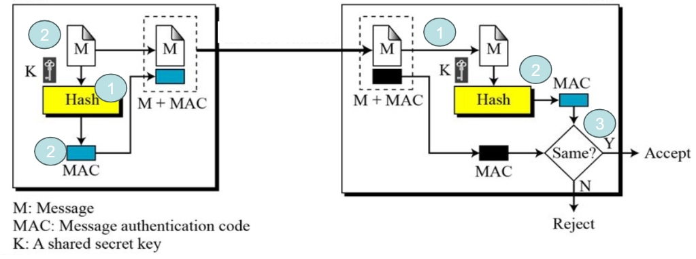
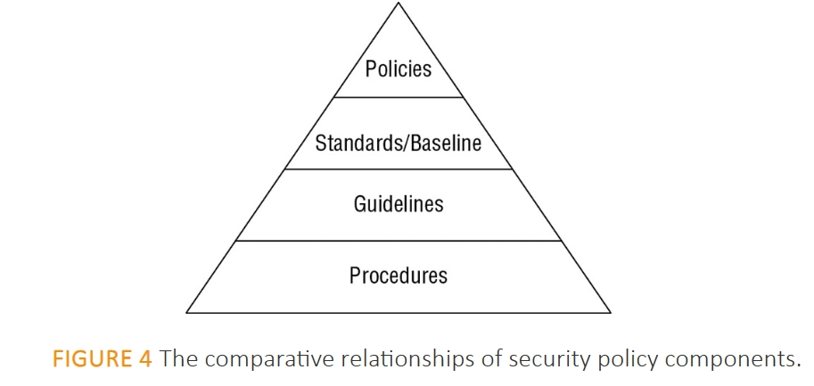
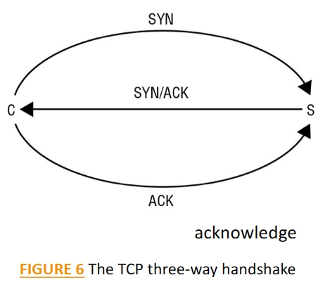
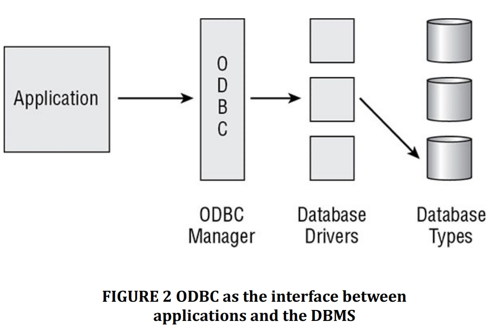

# Cybersécurity #

## 1. Cryptography ##

### Cybersecurity's objective ###
To defend computers, data, servers, and networks against malicious attacks.

* Attack is a malicious action that does not comply with the security policy of a system, is also the exploitation of a vulnerability.

* Vulnerability is a weakness in the system that can be exploited for unintended purposes.

### The four security properties ###
Confidentiality, Integrity, Authentication, and Non-repudiation.

### Symmetric Cryptography ### 
Focused on shared secret keys for encryption and decryption of messages.

### Asymmetric Cryptography ### 
Involves public and private keys for secure communication between parties.

### Hash Functions ###
Used to ensure **the integrity of messages**.

### Electronic Signature ###
<big>Electronic Signature = Asymmetric Cryptography + Hash Function</big>

1. 发送者拥有：私钥+公钥

- Data == Hash Algorithm ==> 哈希信息 == 发送者私钥（signing） ==> -Electronic signature
- 【由于使用私钥，仅有发送者可生成签名】

2. Data 及 电子签名由网络传输

3. 接收者：
- 传输后Data == Hash Algorithm ==> Hash值
- 传输后电子签 == 传输者公钥（Decryption） ==> Hash值
- 当两个hash值相同 ==> 签名有效（发送者身份验证&不可否认&数据完整性）
- 当两个hash值不同 ==> 签名无效

### Man in the Middle Attack (MITM) ###
1. MITM 将公钥发送给发送者及接收者，使双方认为是对方公钥
2. 发送方发送加密信息是误用MITM的公钥加密 ==> MITM 可用其私钥解密信息
3. MITM 可以读取、修改后再用正确的公钥（接收者公钥）加密信息发送给接收者
4. 接收者收到信息后可用私钥解密
5. 双方在此情况下可能不知道通信被窃听或修改
6.  to guarantee the identity of the person linked to the public key： 解决方式为使用Electronic Certificate

### Electronic Certificate ###
<big>Electronic Certificate = Information + Electronic Signature</big>

1. INFO 包括:
- 版本号(version)
- 序列号(Serial Number)
- 签名算法ID(Signature Algorithm ID)
- 颁发者名称(Issuer Name)
- 有效期(Validity Period, -start and end time)
- 主题名称(Subject Name)
- 主题公钥信息（包含算法ID和公钥值）(Subjet Public Key Info,-Algorithm ID and Public Key ID)
- 颁发者和主题的唯一标识符(Issuer and Subject Unique ID)
- 扩展(Extension)

2. 签名（包含算法ID和签名值）(Signature, -Algorithm ID ande Signature Value)

3. Certification Authority (CA).
    - CA是一个受信任的第三方，拥有一对密钥：公钥（pk(CA)）和私钥（sk(CA)）。
    - CA使用其私钥来生成证书上的签名。人们在不需要进一步验证的情况下信任CA.（发送者和接收者都应该信任这个CA，并且他们的数据库中已经存有CA的公钥。）
    - CA使用其私钥生成证书的签名，发送者和接收者可以无障碍地使用CA的公钥。
    - 发送者在获得接收者的证书后使用其公钥。在使用接收者的公钥之前，发送者必须验证接收者的证书，以确保接收者与该证书相连，并验证CA的身份认证、不可抵赖性和接收者公钥信息的完整性。发送者通过使用CA的公钥来验证接收者证书上的签名来完成这一过程。

4. About CA:
- CA uses its sk(CA) to generate a certificate for a person/server
- CA uses its sk(CA) to generate a certificate for itself
    --> CA has Cert(CA): self-Signed
- Any person trusts CA stores Cert(CA), 发送者存储CA，可以直接使用从Cert(CA)获得的pk(CA)

### Trust Models ###
1. Root CA Model
- The CA root has its private/public keys and its self-signed certificate which contains its public key. The CA signs by using its private key the certificates 1, 2, 3
- You need to trust the CA root and its public key. The public key of CA is used to verity the signatures of the certificates 1, 2 , 3

2. Hierarchical Model
- The CA root has its private/public keys and its self-signed certificate which contains its public key.
- The CA root generates for each of CA1 and CA2 their key pair.
- The CA root signs by using its private key the certificates of CA1 and CA2.
- You need to trust AT LEAST the CA root and may be or not CA1 and CA2.

Hierarchical Model 由多个Root CA Model连接组成，不同Root CA Model 的CA之间的通信由CA Root配对。

## 2. Cryptography ##
### MAC(Message Authentication Code) 消息验证码 ###


### The life cycle of an electronic certificate ###
1. Request for a certificate 请求证书：用户或系统向证书颁发机构（CA）提交请求，以获取一个电子证书。
2. Generation of a Certificate 生成证书：CA验证请求者的信息，并生成一个电子证书。
3. Issuance of certificate 发行证书：CA将生成的证书发行给请求者。
4. Use of the certificate 使用证书：证书持有者使用该证书进行各种电子交易或通信，以证明其身份。
5. Certificate Expiration 证书过期：证书在一定的有效期后会过期，不再可用。

在4、5阶段有两个附加过程：

6. Revocation of the Certificate 证书吊销：如果证书被发现有问题，如私钥泄露，或者证书信息不再有效或被误发，证书可以被吊销。
7. Renewal of the Certificate 证书更新：证书接近过期时，可以通过更新过程来延长其有效期。

### public key infrastructure (PKI) 公钥基础设施 ###
组成部分：
1. Registration Authority, RA 注册机构：负责验证证书请求者的身份。
2. Certificate Authority, CA 证书颁发机构：负责生成和签发证书。
3. Public Directory: 公共目录：通常是一个可查询的数据库，存储了发行的证书和吊销列表。

用户请求证书、使用证书的具体步骤：
1. Identity of the client: request for keys and certificate.
    
    用户从工作电脑发起证书请求，并提供身份信息。

2. Sending of the private key in a secure manner.

    RA验证用户的身份，并生成一对密钥（公钥和私钥），私钥以安全的方式发送给用户

3. Request for a Certificate : Sending of the public key for the
certification.

    用户将公钥发送给CA请求签名。

4. Sending of the signed certificate.

    CA签发证书，将签名的证书发送给用户。

5. Signed certificate placed in cRA system.

    签名的证书被放置在cRA系统中。

6. User downloads certificate.

    用户从系统下载证书。

7. User encrypts private key and stores in LICS with certificate.

    用户在本地证书存储加密私钥，并将证书与私钥存储在一起。

### TLS protocol ###
1. SSL/TLS: Protocol aims to secure communications between a Client and a Server 保护客户端和服务器之间的通信
- SSL: Secure Socket Layer (Version 1) 安全套接字层
- TLS: Transport Layer Security 传输层安全

    TLS operates in a client-server mode

- TLS实际上是SSL协议的第三个版本。

2. TLS主要组件：
    - Symmetric Cryptography 对称加密：用于在客户端和服务器之间加密通信数据。
    - Hash Functions 散列函数用来确保数据的完整性，防止在传输过程中被篡改。
    - Asymmetric Cryptography 非对称加密：主要用于在会话开始时安全地交换对称密钥和验证服务器的身份。

3. TLS协议在Web应用中的实际应用
    - 客户端（浏览器）与服务器通信的安全性
    - 安全网站通常用"https://"开头，显示一个安全锁标志
    - 不安全或被感染的网站可能会有警告标志

4. TLS协议确保的安全属性
    - Server authentication 服务器认证：通过电子签名实现。
    - Server non-repudiation 服务器不可否认性：也是通过电子签名保证。
    - Confidentiality of exchanged data 交换数据的保密性：通过对称加密实现。

5. TLS会话的建立过程
    - 客户端（浏览器）和服务器各自生成一个随机数（RNc和RNs）。
    - 服务器将其公钥和证书发送给客户端。
    - 客户端验证服务器的证书，包括检查证书颁发机构（CA）是否可信、证书是否有效或已吊销、证书中的公钥是否可以验证证书上的签名。
    - 客户端生成一个预主密钥（PMsc），使用服务器的公钥加密后发送给服务器。
    - 服务器使用其私钥解密预主密钥。
    - 客户端和服务器都使用预主密钥和之前交换的随机数计算出主对称密钥（MS）。
    - 该主对称密钥用于加密和解密客户端和服务器之间传输的所有数据，确保通信的保密性和数据的完整性。

    - 过程确保了TLS会话的安全性 => 使得传输的数据对任何窃听者都是不可读的。
    - 验证了服务器的身份，保护了客户端不会与假冒的服务器进行通信。

### card payment systems ###

1. 银行卡的优势：银行卡相较于现金和其他支付方式，简单易得、体积小巧便于携带，并包含保险/援助服务。

2. 关键银行数据：银行卡存储了关键的银行信息，如持卡人姓名、账号（PAN,Primary Account Number）、过期日期(Expiration Date)和安全码（Security Code），这些信息对于进行在线支付、接触支付、非接触式NFC支付和磁带支付至关重要。

3. 安全假设：客户通常认为银行卡是非常安全和可靠的，因为它在智能芯片中存储了关键的银行数据，并且智能芯片提供了一个高度安全的环境。

4. NFC Attack NFC攻击：研究证明，银行卡系统中的安全假设并不完全准确。通过NFC攻击，攻击者可以使用NFC读卡器和放大器，从远距离（高达1.50米）窃取银行数据（PAN和过期日期），无需偷取实体银行卡。

5. 恶意利用：恶意攻击者可以利用被盗的银行数据在互联网上进行欺诈性交易，例如在不要求安全码的网站上使用。

6. Brute Force Attack 暴力攻击：攻击者可以尝试使用暴力方法破解安全码，尤其是当网站没有屏蔽此类攻击时。

7. Merchant's Proof 盗取商家凭证：小偷可以轻易盗取商家的收据，从而获取多个客户的银行数据，因为商家可能不会谨慎保护这些凭证，或者在不再需要这些凭证后将其丢弃。

8. 支付方式：Contact Payment，Contactless-NFC Payment，Magnetic Stripe Payment

### EMV Security Standard 安全标准 ###

1. EMV安全标准（EMV Security Standard）：指定了银行卡和支付终端之间通信的安全协议，EMV代表Europay, MasterCard, and Visa。。

2. EMV安全协议（EMV Security Protocol）：保障带接触或非接触功能的银行卡（如带NFC的智能手机模拟银行卡）在购买交易中的通信安全。

3. EMV参与者（EMV Actors）：包括发卡银行（Issuing Bank, IB）、收单银行（Acquiring Bank, AB）、支付方案（Payment Scheme, PS）、客户端支付设备（Client's Payment Device, C）和商家的支付设备（Merchant's Payment Device, P）。

4. EMV安全元素（EMV Security Elements）：涉及到的安全元素包括发卡银行（Issuing Bank, IB）和客户端设备（Client's Payment Device）的密钥（Key）和证书，以及加密算法和密钥（如DESKkey）。

5. EMV协议会话（EMV Protocol Session）：描述了从交易初始化到实际交易（在线或离线）的四个阶段，包括客户端和商家的支付设备的身份验证以及交易数据的生成和验证。

6. 交易数据（Transaction Data, TD）

### Q1 ###
- How P verifies the authenticity of C (what are the steps) ? 

- In the context of EMV transactions, "P" typically refers to the Point of Sale (PoS) terminal, and "C" refers to the Customer or the Customer's payment device (such as an EMV card or NFC-enabled smartphone). 

    Here's how the PoS terminal (P) verifies the authenticity of the customer's payment device (C):

    1. Card Reading
    2. Data Retrieval
    3. Certificate Verification
    4. Challenge-Response
    5. Signature Verification
    6. Offline Data Authentication (ODA)
    7. Transaction Authorization
    8. PIN Verification

### Q2 ###
- How IB verifies ARQC to authorize the transaction (what are the steps) ?

- The ARQC (Application Request Cryptogram) is a type of cryptogram used in EMV card transactions to ensure the authenticity and integrity of transaction data and to protect against fraud. 
    
    The process of how an Issuing Bank (IB) verifies an ARQC to authorize a transaction typically involves several steps:
    1. Reception of ARQC
    2. Decryption and Validation
    3. Data Integrity Check
    4. Authentication
    5. Risk Management
    6. Authorization Response
    7. Completion

## 3. Cybersecurity ##

### Definitions of Cybersecurity ###
1. Wikipedia:
    Computer security, cybersecurity or information technology security (IT security)is the protection of computer systems and networks from the theft of or damage to their hardware, software, or electronic data, as well as from the disruption or misdirection of the services they provide.

2. Cisco:
    Cybersecurity is the practice of protecting systems, networks, and programs from digital attacks. These cyberattacks are usually aimed at accessing, changing, or destroying sensitive information, extorting money from users, or interrupting normal business processes.

Various definitions highlighting protection against digital attacks, data theft, and service disruption.

### Security Objectives : CIA Triad ###
Focuses on the CIA Triad (Confidentiality 保密性, Integrity 完整性, Availability 可用性) and related risks and countermeasures.


1.  Confidentiality

    Definition:

    - Ensures the protection of the secrecy of data, objects, or resources
    - No one other than the intended recipient of a message receives it or can read it
    - Only authorized users to access and interact with resources,
    - But it prevents unauthorized users from doing so => disclosure

- Sensitivity: 信息的质量，如果泄露可能会造成伤害或损害。
- Discreyion: 决策行为，操作者可以影响或控制披露，以尽量减少损害或损害。
- Criticality 关键性：信息对于任务的关键程度。危险程度越高，就越有可能需要保持信息的机密性。
- Concealment 隐藏: 是隐藏或防止披露的行为：一种掩盖、混淆或分散注意力的手段。
- security through obscurity ：the concept of a;emp'ng to gain
protec'on through hiding, silence, or secrecy.
- Secrecy ：保守秘密或防止信息泄露的行为。
- Privacy: 对可识别个人身份的信息或泄露后可能会给某人造成伤害、尴尬或耻辱的信息保密。
- Seclusion ：involves storing something in an out-of-the-way location. This location can also provide strict access controls.
-  Isolation: is the act of keeping something separated from others.


    Risks:

    - Attacks on confidentiality
    - Events that lead to confidentiality breaches:
        - Failing to properly encrypt a transmission,
        - Failing to fully authenticate a remote system before transferring data
        - Leaving open otherwise secured access points,
        - Accessing malicious code that opens a back door,
        - Misrouted faxes, documents left on printers,
        - Walking away from an access terminal while data is displayed on the monitor,
        - Actions of an end user or a system administrator,
        - An oversight in a security policy or a misconfigured security contro

    Countermeasures:

    - Encryption
    - Network traffic padding :在网络流量中添加附加数据，使识别发送者、接收者和/或正在传输的数据变得更加困难
    - Strict access control
    - Rigorous authentication procedures
    - Data classification:Secret, confiden'al, private, public, etc
    - Extensive personnel training.

2. Integrity

    Integrity violaJons can occur because of the acJons of any user.

    Definition:
    - Integrity is the concept of protec2ng the reliability and correctness of data
    - It prevents unauthorized altera2ons of data: 确保数据保持正确、不被更改和保存
    - Confiden2ality and integrity depend on each other:没有对象完整性，机密性就无法维持
    - Integrity can be examined from 3 perspectives:
        - Preventing unauthorized subjects from making modifications 防止未经授权的主体进行修改
        - Preventing authorized subjects from making unauthorized modifications, such as mistakes 防止授权主体进行未经授权的修改
        - Maintaining the internal and external consistency of objects 保持对象内部和外部的一致性

- Accuracy 准确性
- Truthfulness
- AuthenJcity
- Validity 有效性：事实或逻辑合理
- Nonrepudiation 不可否认性: 无法否认已执行的行动或活动，或无法验证通信或事件的来源
- Accountability 责任：对行为和结果负责或有义务
- Responsibility ：负责或控制某事或某人
- Completeness 完整性：拥有所有需要的和必要的组件或零件
- Comprehensiveness 全面性：范围完整；充分包含所有需要的元素

    Risks:

    -  Numerous attacks focus on the violation of integrity
        - Viruses, logic bombs, unauthorized access, errors in coding and applications,malicious modification, intentional replacement, and system back doors.
        - As with confidentiality, human error, oversight, or ineptitude.
    -  Events that lead to integrity breaches
        - Modifying or deleting files 修改或删除文件
        - Entering invalid data 输入无效数据
        - Altering configurations 改变配置
        - Including errors in commands, codes, and scripts 包括命令、代码和脚本中的错误
        - Introducing a virus 引入病毒
        - Executing malicious code such as a Trojan horse 执行恶意代码

    countermeasures:

    - Strict access control,
    - Rigorous authentication procedures,
    - Intrusion detection systems,
    - Object/data encryption, hash total verifications
    - Interface restrictions, input/function checks,
    - Extensive personnel training

3. Availability

    Authorized subjects (user, software, etc.) are granted timely and uninterrupted access to objects (data, file, service, device, etc.)

    Definition:

    - Availability includes efficient uninterrupted access to objects
    - Prevention of denial-of-service (DoS) attacks
    - Availability requires supporting infrastructure (network services, communications, etc.) to be: Functional & Allows authorized users to gain authorized acces
    - Requirements to maintain Availability on a system:
        - Controls to ensure authorized access, 确保授权访问的控制
        - An acceptable level of performance,可接受的性能水平
        - Quickly handle interruptions,快速处理干扰
        - Provide for redundancy,提供冗余
        - Maintain reliable backups,维护可靠的备份
        - Prevent data loss or destruction,防止数据丢失或破坏。

- Availability depends on both integrity and confidentiality 没有完整性和机密性，就无法维持可用性
- Usability 易于使用或学习或能够被主体理解和控制的状态，
- Accessibility 确保最广泛的主体可以与资源交互，无论其能力或限制如何
- Timeliness 在合理的时间范围内及时、准时或提供低延迟响应。

    Risks:

    - Events that lead to Availability interruptions
        - Device failure => Destruction,
        - Software errors,
        - Environmental issues (heat, static, flooding, power loss...) => Destruction
        - DoS attacks,
        - Object destruction,
        - Communication interruptions

    - Events caused by human error, oversight, or ineptitude

    Countermeasures:

    - Designing intermediary delivery systems properly, using access controls effectively,
    - Monitoring performance and network traffic, using firewalls and routers to prevent DoS attacks,
    - Implementing redundancy for critical systems, 为关键系统实施冗余，
    - Maintaining and testing backup systems.
    - Train the personnel
    - Use of fault tolerance features at the various levels of access/storage/security => the goal of eliminting single points of failure to maintain availability of critical systems. 在访问/存储/安全的各个级别使用容错功能，以消除单点故障以维持关键系统的可用性。

### AAA Security Concept ### 
Covers Authentication, Authorization, and Accounting, including their components and significance.

- Concept AAA: authentication, authorization, and accounting
- Refers to 5 elements: identification, authentication, authorization, auditing, and accounting 缺少这五个要素中的任何一个都可能导致安全机制不完整

    - **Identification**: Claiming to be an identity when acempting to access a secured area or system 是主体表明身份的过程, 主体必须向系统提供身份才能启动身份验证、授权和问责 (AAA) 过程;如果没有身份，系统就无法将身份验证因素与主体关联.。
    
        一旦主体被识别，身份就对该主体的任何进一步行为负责，That process is authentication。

    - **Authentication**: Proving that you are that identity 验证或测试所声明的身份是否有效的过程, 真实性要求主体提供与其所声称的身份相对应的附加信息, 可以提供多种类型的身份验证, 最常见的形式是使用密码。

    - **Authorization**: Defining the permissions (i.e., allow/grant and/or deny) of a resource and object access for a specific identity 授权确保在分配给经过身份验证的身份的权利和特权的情况下，可以进行所请求的活动或对对象的访问，一旦主体经过身份验证，就必须授权访问；
    
    主体已被识别和验证（登录）并不意味着被授权执行任何职能或访问受控环境内的所有资源。
    
    授权通常使用访问控制模型之一来定义：
        1. Discre'onary Access Control (DAC),自主访问控制
        2. Mandatory Access Control (MAC),强制访问控制
        3. Role Based Access Control (RBAC or role-BAC),基于角色的访问控制

    - **Auditing**: Recording a log of the events and activities related to the system and subjects 审计或监控是跟踪和记录主体行为的程序化手段,也是检测系统上未经授权或异常活动的过程。

        - Auditing is needed to detect:

            - Malicious actions by subjects 主体的恶意行为
            - Attempted intrusions
            - System failures

        - Auditing is needed to:

            - Reconstruct events 重建事件
            - Provide evidence for prosecution 为起诉提供证据
            - Produce problem reports and analysis 生成问题报告和分析

        - It is possible to monitor without auditing: can’t audit without some form of monitoring 没有某种形式的监控就无法进行审计.


    - **Accounting (aka accountability)**: Reviewing log files to check for compliance and violations in order to hold subjects accountable for their actions 只有保持问责制，组织的安全策略才能得到正确执行, 有效的问责依赖于证明主体身份并跟踪其活动的能力。

### Protection mechanisms / Protection controls ### 
并非所有的安全控制都有保护机制，但 many controls offer their protection for confidentiality, integrity, and availability
using these mechanisms

- Protection mechanisms:
    1. Layering / level of access
        aka defense in depth, is the use of mulJple controls in a series

    2. Abstraction
        - Puang similar elements into groups, classes, or roles that are assigned security controls, restrictions, or permissions as a collective 将相似的元素放入组、类或角色中，并作为集合分配安全控制、限制或权限
        - Classifying objects or assigning roles to subjects 对对象进行分类或为主体分配角色
        - 用于定义：对象可以包含的数据类型、执行的功能类型、具有何种功能
        - AbstracJon simplifies security by enabling the user to assign security controls to a group of objects collected by type or function 通过使用户能够将安全控制分配给按类型或功能收集的一组对象来简化安全性

    3. Data hiding
        - 防止数据被主体发现或访问
        - 将数据放置在受试者无法访问或看到的逻辑存储隔间中
        - 防止未经授权的访问者访问数据库
        - 限制较低分类级别的主体访问较高分类级别的数据
        - 防止应用程序直接访问硬件

    4. Encryption
        -  hiding the meaning or intent of a communicaJon from unintended recipients
        - 加密是安全控制中的一个重要元素，特别是在系统之间的数据传输方面

### Security management planning: Plans ###
    

- Organizational Processes and Roles: 

    安全角色是个人在组织内安全实施和管理的总体方案中所扮演的角色.安全角色不一定在工作描述中规定，因为它们并不总是独特或静态的:

 6 roles are presented in the logical order in which they appear in a secured environment:
- Senior Manager
- Security Professional
- Data Owner
- Data Custodian
- User
- Audito

### Security Control Frameworks ###


倒金字塔用于传达每个文件的体积或大小

1. Security Control Frameworks 定义组织所需的安全解决方案的结构

2. COBIT(Control Objectives for Information and Related Technology) 规定了安全控制的目标和要求,鼓励将 IT 安全理念映射到业务目标

    COBIT 5 is based on 5 key principles for governance and management of enterprise IT:
    - Principle 1: Meeting Stakeholder Needs
    - Principle 2: Covering the Enterprise End-to-End
    - Principle 3: Applying a Single, Integrated Framework
    - Principle 4: Enabling a HolisSc Approach
    - Principle 5: SeparaSng Governance From Management

3. 基于风险威胁的建模方法1【PASTA】: Process for Attack Simulation and Threat Analysis 

    7-stage threat modeling methodology：
    - Stage I: Definition of the Objectives (DO) for the Analysis of Risks
    - Stage II: Definition of the Technical Scope (DTS)
    - Stage III: Application Decomposition and Analysis (ADA)
    - Stage IV: Threat Analysis (TA)
    - Stage V: Weakness and Vulnerability Analysis (WVA)
    - Stage VI: Attack Modeling & Simulation (AMS)
    - Stage VII: Risk Analysis & Management (RAM)

PASTA 的每个阶段都有一个具体的要实现的目标列表和完成该阶段要产生的可交付成果。

4. 基于风险威胁的建模方法2【VAST】Visual, Agile, and Simple Threat 

    基于敏捷项目管理和编程原理的威胁建模概念，目标是在可扩展的基础上将威胁和风险管理集成到敏捷编程环境中。

Acempting to identify every specific acack method and technique is an impossible task.

## 4. Network Security ##
- An intranet is a private network that is designed to host the same information services found on the internet: 
    - 访问专用网络外部无法访问的内部服务器上的网络、电子邮件、存储等
    - 如果网络依赖外部实体在内部提供服务，那么它不被视为 Intranet

- An extranet is a cross between the internet and an intranet:
    - 充当专用网络的内联网
    - 可以通过称为非军事区 (DMZ) 或外围网络的部分向互联网提供信息
    - 很少出现在公共网络上

### IS security / Network security ###
- The whole means of security must be homogeneous 整个安全手段必须是同质的
- Network is just an angle to consider for security 网络只是安全考虑的一个角度

### Various kind of attacks ###
1. Active attacks
    - Paralysis, Denial of Service, Saturation 
    - Disguising (simulates connection process, IP or identity usurpation...)
    - Service hijacking
    - Alter information

2. Passive attacks
    - Screenshot
    - Unauthorized traffics listening
    - Routing modification
    - Radio emission capture

3. Indirect attacks
    - Asking for information through mailing


### Modern attack strategy ###
1. Infection
    - 让用户点击不良链接
    - 利用漏洞运行
    - 通过已打开的应用程序或连接在后台传播恶意软件 Drive-by-download
    - 恶意软件试图通过各种手段避免被安全软件发现的策略。
    - Hide transmission 使安全机制无法发现恶意软件（SSL ...）
    - 仅需一个链接

2. Persistence
    - 在受感染的组件上维护机器人
    - 恶意软件提供对受感染系统的root访问
    - Backdoor enables attacker to gain access to the system
    - 防病毒功能禁用防病毒功能，防止检测到恶意软件 Infecting the Master Boot Record (MBR)

3. Communication
    - 安装的恶意软件必须能够 To communicate with the command & control components, 发送被盗数据
    - 沟通必须是隐秘的，不能引起怀疑
    - 可通过以下方式完成：
        - Encryption 加密 : SSL, SSH, proprietary encryption BitTorrent ...
        - Bypass, circumvention 绕行: 使用代理、在允许的其他协议或允许的协议内建立隧道应用程序
        - Port evasion 端口规避: via network anonymizer, tunnel over open port 通过网络匿名器，通过开放端口建立隧道。
        - Botnet sends Command & Control (C&C) instructions through IRC...
        - Dynamic DNS: 通过多个受感染主机代理流量，重新路由它，使取证变得困难

4. Command & Control
    - 使恶意软件或攻击
    - 通过常见应用程序完成
    - 攻击者目标：如何在不被发现的情况下感染、持续、交流、控制、更新

### Security within the network ###


- TCP/IP 几乎存在于所有可用的操作系统中
- 消耗大量资源
- 相对容易被黑客入侵，因为其是为易用性而不是安全性而设计的

### Transport Layer Protocols: TCP and UDP ###
- Transmission Control Protocol (TCP) is a full-duplex connection-oriented protocol 全双工面向连接
- User Datagram Protocol (UDP) is a simplex connectionless protocol 单工无连接
- When a communication connection is established between two systems, it is done using ports

    TCP and UDP each have 2^16 = 65,536 ports, since port numbers are 16-digit binary numbers

- A port allows a single IP address to be able to support multiple simultaneous communications 单个IP地址支持多个同时通信
- The combination of an IP address and a port number is known as a socket

1. TCP is connection oriented: Handshake process (Figure 6)
    - The client sends a SYN flagged packet to the server
    - The server responds with a SYN/ACK flagged packet back to the client
    - The client responds with an ACK flagged packet back to the server


2. TCP channel ending: 
    - FIN (finish) flagged packets instead of SYN flagged packets
    -  RST (reset) flagged packet, which causes an immediate and abrupt session termination

3. Slowloris/HOIC (High Orbit Ion Cannon) attack
    它使服务器的连接池因未完成的 TCP/IP 通道建立序列而饱和

### TCP/IP Protocol ### 
- 典型的 TCP/IP 网络在任何给定时刻都在使用数百种协议
- 使用嗅探器sniffer，您可以发现当前网络上正在使用哪些协议(Wireshark)

1. Internet Protocol (IP):
    - 为数据包提供路由寻址
    - 提供了一种身份手段并规定了传输路径
    - 是无连接的，是不可靠的数据报服务
    - 不提供“数据包将被交付”“数据包以正确顺序交付”“数据包仅会被传送一次”的保证
    - 必须在 IP 上使用 TCP 才能获得可靠且受控的通信会话

2. TCP/IP Vulnerabilities
    - 实施不当的 TCP/IP 堆栈容易受到以下影响：缓冲区溢出、SYN Flood 攻击、DoS 攻击、分片攻击、超大数据包攻击、欺骗攻击、中间人攻击、劫持攻击和编码错误攻击。
    - TCP/IP 还容易受到通过监视或嗅探的被动攻击

### Internet Control Message Protocol: ICMP ###
- ICMP 用于确定网络或特定链路的健康状况
- ICMP 由 ping、traceroute、pathping 和其他网络管理工具使用
- ping 实用程序使用 ICMP 回显数据包并将其从远程系统反射回来
- 可以使用 ping 来确定是否：远程系统在线，远程系统响应迅速，中介系统支持通信、中间系统通信的性能效率水平。
- ping 实用程序包括重定向功能，允许将回显响应发送到与原始系统不同的目的地
- ICMP 通常被用于各种形式的基于带宽的拒绝服务 (DoS) 攻击
- 许多网络限制 ICMP 的使用或至少限制其吞吐率


### Address Resolution Protocol (ARP) ###
- ARP是TCP/IP协议族的一个子协议，运行在数据链路层（第2层）
- 将 IP 地址（32 位二进制数）解析为媒体访问控制 (MAC) 地址（48 位二进制数），或 EUI-48 甚至 EUI-64
- 网段上的流量使用 MAC 地址从源系统定向到目标系统
- ARP 使用缓存和广播来执行其操作。
- 将 IP 地址解析为 MAC 地址（反之亦然）的第一步是检查本地 ARP 缓存
- 攻击包括：ARP cache poisoning（攻击者将虚假信息插入 ARP 缓存） & ARP spoofing（为请求的 IP 寻址系统提供虚假 MAC 地址）
- 对策包括：为关键系统定义静态 ARP 映射；监控 ARP 缓存以进行 MAC 到 IP 地址的映射；使用 IDS 检测系统流量异常和 ARP 流量变化

### Domain Name Systems - DNS ###
1. There are three different layers to be aware of: 
    - MAC address: 硬件地址是“永久”的物理地址
    - IP address: 是在 MAC 地址上分配的“临时”逻辑地址。
    - Domain name: 计算机域名是通过 IP 地址分配的“临时”human-friendly 约定

2. 要将 DNS 名称解析为 IP 地址，计算机：
    - 检查本地缓存（其中包括 HOSTS 文件中的内容）；
    - 向已知 DNS 服务器发送 DNS 查询；
    - 向任何可能的本地子网 DNS 服务器发送广播查询
- 如果客户端未通过上述任何步骤获得 DNS 到 IP 解析，则解析失败，并且无法发送通信

3. DNS Poisoning
    当攻击者向请求系统发送虚假回复时，就会发生 DNS 欺骗
    - 针对 DNS 的攻击称为resolution attacks
    - DNS 中毒是伪造 DNS 信息以到达所需系统的行为
    - 最简单的方法是破坏 HOSTS 文件或 DNS 服务器查询
    - 攻击者可能会使用以下技术之一：
    
        (1)部署恶意 DNS 服务器 Deploy a rogue DNS server (aka DNS spoofing or DNS pharming); 
        
        (2)修改HOSTS文件Alter the HOSTS file; 
        
        (3)损坏 IP 配置 Corrupt the IP configuration; 

        (4)使用代理伪造（用于Web应用程序）Use proxy falsification (used for web applications)

4. DNS Pharming
    - 域欺骗是指将有效网站的 URL 或 IP 地址恶意重定向到虚假网站（原始有效网站的虚假版本）
    
5. Domain Hijacking
    - 域名劫持或域名盗窃是未经有效所有者授权而更改域名注册的恶意行为

6. DNS Homograph Attack
    - 同形异义词攻击利用字符集的相似性来注册肉眼看来合法的虚假国际域名 (IDN)

### Threats against communication system ###
MAIN ATTACKS:

1. Denial-of-service attack: DoS and DDoS 
    - DoS 攻击是一种资源消耗攻击:利用硬件或软件漏洞的攻击; 用垃圾网络流量淹没受害者的通信管道的攻击
    - Distributed denial-of-service 分布式拒绝服务（DDOS）：是一种涉及僵尸系统的攻击

2. Eavesdropping 窃听

    - 窃听是监听通信流量以复制它
    - 窃听通常需要对 IT 基础设施进行物理访问
    - 通常使用网络流量捕获或监控程序或协议分析器系统（嗅探器）来促进窃听
    - 窃听通常是一种被动攻击，但当它用于改变或注入通信时，称为主动攻击

3. Impersonation/Masquerading 冒充/伪装

    - 冒充他人或某物以获得对系统的未经授权的访问
    - 通过捕获用户名和密码或网络服务的会话设置过程可以进行模拟
    - 一些防止冒充的解决方案：
        - Onetime pads authentication 一次性身份验证
        - Token authentication systems, using Kerberos令牌验证
        - Encryption to increase the difficulty of extracting authentication credentials from network traffic 增加从网络流量中提取身份验证凭据的难度

4. Replay Attacks重放攻击, modifications Attacks修改攻击

    - 重放攻击：模仿攻击的一个分支，尝试通过针对系统重放捕获的流量来重新建立通信会话。通过使用一次性认证机制和顺序会话识别预防。
    - 修改攻击：捕获的数据包被更改并针对系统进行播放，以绕过改进的身份验证机制和会话排序的限制。使用数字签名验证和数据包校验和验证预防。
    - 对策：更改发送给客户端的文档的 HTML 代码中的超链接 URL

5. Hyperlink Spoofing 超链接欺骗

    - 用于将流量重定向到恶意或冒名顶替系统
    - 更改发送给客户端的文档的 HTML 代码中的超链接 URL

### Wireless Networks ### 
1. 无线网络是在网络节点之间使用无线数据连接的网络， 易于部署，成本低廉，设备可以在网络信号范围内自由漫游。
2. 802.11 是无线网络通信的 IEEE 标准
3. Securing Wireless Access Points (WAP)
4. Securing the Service Set IDentifier (SSID)
    - 无线网络分配有一个 SSID（基本 SSID 或扩展 SSID）
    - 如果同一无线网络中涉及多个基站或WAP，则定义扩展站集标识符（ESSID）
    - SSID 由供应商默认定义，应在部署前更改为唯一的名称
5. Using Secure Encryption Protocols
    - 用户向 WAP 进行身份验证的方法： 开放系统认证（OSA）& 共享密钥身份验证 (SKA)
6. Wi-Fi Protected Access (WPA)
    - WPA 基于：轻量级可扩展身份验证协议 (LEAP) 和临时密钥完整性协议 (TKIP) 以及用于身份验证的秘密密码
    - 缺点：使用单个静态密码；针对 WPA 网络的暴力猜测攻击以发现密码；密码应为14个字符或更多，但并非不可能破解；LEAP 和 TKIP 加密现在均可破解

7. MAC Filter
    - MAC 过滤器是授权无线客户端接口 MAC 地址的列表，WPA 使用它来阻止对所有未经授权设备的访问

8. Wi-Fi Protected Setup (WPS)
    - WPS 简化了向安全良好的无线网络添加新客户端的过程
    - 通过自动连接第一个新的无线客户端来寻找网络来运行
    - 大多数 WAP 上默认启用 WPS
    
9. Using Captive Portals 使用强制门户
    - 强制门户是一种身份验证技术，可将新连接的无线 Web 客户端重定向到门户访问控制页面
    - 门户页面可以要求用户输入付款信息、提供登录凭据或输入访问代码
    - 它显示可接受的用户策略、隐私策略和跟踪策略，以及用户在能够通过网络进行通信之前对这些策略的同意

### Wireless Attacks ###
1. War driving:使用检测工具寻找无线网络信号的行为

2. War chalking: 被用来向其他人披露无线网络的存在，以便共享发现的互联网链接

3. Replay: 重新传输捕获的通信，以期获得对目标系统的访问权限

4. Initialization Vector:通过降低可预测性和可重复性来提高算法安全性

5. Rogue Access Points:流氓 WAP 可能是员工为了方便而植入的，也可能是由攻击者在外部操作的

6. Evil twin:黑客操作一个虚假的接入点，该接入点将根据客户端设备的连接请求自动克隆或孪生接入点的身份,攻击系统窃听无线信号以请求重新连接

### Firewalls ###
1. 防火墙是管理、控制和过滤网络流量的重要工具
2. 防火墙部署在网络之间：例如专用网络和互联网,防火墙仅针对从一个子网穿越防火墙到另一个子网的流量提供保护
3. 防火墙根据一组规则过滤流量：过滤器或访问控制列表 (ACL)
4. 大多数防火墙提供：广泛的日志记录、审计和监控功能 & 警报和基本入侵检测系统 (IDS) 功能
5. 防火墙通常无法：阻止病毒或恶意代码 & 防止用户未经授权但意外或有意披露信息 & 防止防火墙后面的恶意用户发起的攻击 & 在数据传出或传入专用网络后保护数据

6. 防火墙基本类型：
    -  static packet-filtering firewall 通过检查消息头中的数据来过滤流量
    - application-level gateway firewall （proxy firewall）是一种将数据包从一个网络复制到另一个网络的机制
    - Circuit-level gateway firewalls (aka circuit proxies)用于在可信合作伙伴之间建立通信会话，在 OSI 模型的会话层（第 5 层）运行
    -  Stateful inspection firewalls (aka dynamic packet filtering firewalls) 通过检查源地址和目标地址、应用程序使用情况、来源等来评估网络流量的状态或上下文，在 OSI 模型的网络和传输层（第 3 层和第 4 层）运行。
    - Deep packet inspection (DPI) 在应用层运行的过滤机制

7. Firewall Deployment Architectures
    -  Single tier deployment 单层部署：对于抵御一般攻击很有用，但仅提供最低限度的保护
    
    -  two-tier deployment 双层部署：
    
    - three-tier deployment
    

### Endpoint Security ###
1. 端点是网络通信链路的末端：服务器&客户端
2. 端点安全：每个单独的设备都必须维护本地安全，无论其网络或电信通道是否也提供安全性
3. 每个系统都应具有本地主机防火墙、反恶意软件扫描仪、身份验证、授权、审核、垃圾邮件过滤器和 IDS/IPS 服务的适当组合

### Collaboration Tools ###
1. Secure Communication Protocols
    - Internet Protocol security (IPsec) 使用公钥加密技术来提供
    - Kerberos 为用户提供单点登录解决方案
    - Secure Shell (SSH)一种端到端加密技术
    - Signal Protocol 一种加密协议，为语音通信、视频会议和短信服务提供端到端加密
    - Secure Remote Procedure Call （S-RPC） 身份验证服务和防止在远程系统上未经授权执行代码的方法
    - Secure Sockets Layer (SSL) 用于保护 Web 服务器和 Web 浏览器之间通信的加密协议
    - Transport Layer Security (TLS) 与 SSL 相同，但它使用更强大的身份验证和加密协议
2. Authentication Protocols
    - Challenge Handshake Authentication Protocol (CHAP)
    - Password Authentication Protocol (PAP)
    - Extensible Authentication Protocol (EAP)

3. Secure Voice Communications
    - 语音通信的脆弱性与IT系统安全以及数字设备和VoIP的使用有关
    - 应通过使用加密服务或协议来维护机密性
    - 内部安全：需要物理安全来维持对组织物理位置内语音通信的控制
    - 外部安全：组织外部语音通信的安全由服务提供商负责

4. Voice over Internet Protocol (VoIP)
    - VoIP 是一种将音频封装到 IP 数据包中以支持通过 TCP/IP 网络连接进行电话呼叫的技术
    - 黑客可以对 VoIP 解决方案发起各种潜在攻击：伪造来电等

5. Secure Real-Time Transport Protocol or (SRTP)是对许多Real-Time
Transport Protocol (RTP)的安全改进

6. Multimedia Collaboration 利用各种支持多媒体的通信解决方案来增强远程协作，协作允许员工同时以及跨不同时间段工作

7. Remote Meeting 远程会议

8. Instant Messaging（IM）：企业角度难以管理、不安全

9. Manage Email Security： Simple Mail Transfer Protocol (SMTP)& using Post Office Protocol version 3 (POP3) or Internet Message Access Protocol （IMAP）

### Virtualization ###
1. Virtual Private Network (VPN)
    - VPN 是一种通信隧道，可通过中间不可信网络提供身份验证和数据流量的点对点传输
    - 他们不提供或保证可用性
    - VPN 可以链接两个网络或两个单独的系统：客户端、服务器、路由器、防火墙和交换机。
    - VPN 为依赖有风险或易受攻击的通信协议或方法的遗留应用程序提供安全性
    - VPN 还提供某种匿名性：隐藏您的位置

2. Tunneling 隧道技术
    - 通过将协议数据包封装在另一个协议的数据包中来保护协议数据包的内容
    - 位于通信末端的封装和解封装实体之间存在虚拟路径
    - 如果没有足够的带宽，它会很快使网络饱和
    - Cisco 开发了自己的 VPN 协议，称为第 2 层转发 (L2F)

3. IP Security Protocol (IPsec)
    - 最常用的 VPN 协议是 IPsec
    - IPsec 既是一个独立的 VPN 协议，也是 L2TP 的安全机制
    - IPsec 有两个主要功能： 身份验证标头  Authentication Header(AH) & 封装安全负载 Encapsulating Security Payload （ESP）
    - 在传输模式下，IP数据包数据被加密，但数据包的标头不被加密
    - 在隧道模式下，整个IP数据包被加密，并在数据包中添加一个新的标头

4. Virtual Local Area Network (VLAN)
    - VLAN 是由交换机创建的硬件强制网络分段
    - VLAN管理最常用于区分用户流量和管理流量
    - 同一VLAN成员之间通信畅通无阻
    - VLAN 被视为子网，但它不是子网
    - VLAN 用于在逻辑上对网络进行分段，而无需更改其物理拓扑

5. OS Virtualization
    - 虚拟化技术用于在一台主机上托管一个或多个操作系统
    - 这种机制几乎允许任何操作系统在任何硬件上运行

6. Virtual Networking
    - 虚拟化网络是将硬件和软件网络组件组合成一个集成实体
    - 由此产生的系统允许对所有网络功能进行软件控制：管理、流量整形、地址分配等。
    - 它们允许组织实施或调整其他网络解决方案

7. Intrusion Detection Systems（IDS） 入侵检测系统
    两种方法：
    - Modeling behavior:了解用户、系统、应用程序的行为，以便能够注意到可能表明异常（尝试滥用权限、欺骗等）事件的偏差事件；神经元网络
    - Vulnerability knowledge： 利用熟练的安全知识来寻找利用漏洞的尝试


## 5. Data & Database Security ##

### Databases in IS ###
1. Databases contain information essential to business functions
    - 客户的联系方式，
    - 订单跟踪数据，
    - 人力资源和福利信息，
    - 敏感商业秘密等

2. Databases contain personal information
    - 身份证明：SSN、姓名、ID 等
    - 信用卡使用活动、旅行习惯、购物、电话记录等
    - CNIL授权在法国创建包含个人信息的数据库
    - 在欧洲，必须遵守 GDPR 规则

3. security levels
    - Security at 3 levels: physical, engine and scheme
    - Ensuring that adequate security controls exist: Unauthorized access(越权存取), Falsification（证伪）,Destruction（销毁）.

### Security Mechanisms in DBMS ### 
Discusses the architecture of database management systems, focusing on relational databases, key types, and database normalization.

1. Database Management System Architecture:
    - Relational Database Management Systems (RDBMS)关系数据库管理系统

        4 Key Type：
        - Candidate keys: 确保同一个表中没有两行包含相同的值，一个表可以有一个或多个
        - Primary keys：每个表只有一个主键，RDBMS 应用主键的唯一性，完整性约束
        - Alternate keys：被选为主键的候选键
        - Foreign keys： 外键用于实现两个表之间的关系，也称为引用完整性
    
    - Hierarchical and distributed architecture 分层分布式架构
    - NoSQL database architecture NoSQL数据库架构

2. Relational databases: Query Language
    - 所有关系数据库都使用标准语言，结构化查询语言（SQL）
    - SQL 分为两种不同的子语言：DDL、DML

3. Database transactions：关系数据库支持显式（ explicit ）和隐式（implici）使用事务来保证数据完整性
4. 所有数据库事务都具有四个必需的特征
    - Atomicity 原子性：一笔交易必须是“全有或全无”
    - Consistency 连贯性：所有事务必须在与数据库中所有规则一致的环境中开始。
    - Isolation 隔离性：交易彼此分开执行。
    - Durability 持久性：在数据库中验证后必须提交数据，数据库使用事务日志等备份机制来确保持久性。

5. Concurrency并发性
    - Concurrency, or editing control,是一种预防性安全机制，可确保存储数据时钟正确 & 完整性和可用性受到保护
    - Concurrency uses a "lock" feature 允许用户进行更改：拒绝其他用户同时访问试图或更改数据项
    - 在某些情况下，管理员使用并发与审核机制来跟踪文档和/或字段的更改。


6. semantic integrity 语义完整性
7. Access controls 访问控制
8. Partitioning - Poly-instantiation 分区
    - Different types of database partitioning：

        Functional partitioning 功能分区

        Vertical partitioning 垂直分区

        Horizontal partitioning 水平分区

9. Poly-instantiation 多实例化

### Open Database Connectivity ##
- ODBC (Open Database Connectivity) 是一种数据库 API，允许应用程序与不同类型的数据库进行通信
- ODBC 充当应用程序和后端数据库驱动程序之间的代理


### Database Security Issues ### 
Highlights security concerns in both relational and NoSQL databases, discussing their vulnerabilities and best practices for ensuring security.

- NoSQL 数据库是非关系型分布式数据库
- NoSQL DB 是应用程序的替代方案：需提高性能
- Big Data requirements: Volume, Velocity, Variety 数量、速度、多样性
- NoSQL Database Categories： 
    - Key-Value 键值数据库：存储任意数据流值, 可以使用密钥（哈希）恢复数据,可以轻松扩展数据
    - Wide-Column 列数据库: 键是列和行的组合, 列数据库就像关系数据库中常见的表.
    - Document 文档数据库: 存储具有一个或多个独立命名字段的文档，例如 JSON/BSON 格式; 是动态的.
    - Graph 图数据库: 遵循灵活的图形模型，可以跨多台机器扩展, 适用于以图形形式表示的数据：网络拓扑、社交网络、路线图等

### NoSQL Database Security ### 
Details the unique security challenges and considerations for NoSQL databases, including their different categories and major security concerns.

- 主要安全问题： Private隐私，Confidentiality 保密，Authorization 授权，Integrity 完整性

### Data Protection Techniques ### 
Discusses encryption, access controls, and other methods to secure data at rest and in transit.

- Protection of data at rest and in motion (transit)
    - Data at rest：写入存储介质的数据
    - Data in transit: 通信期间交换的数据
    - 对于 NoSQL 数据库，移动数据分为两类： Client-node communication & Communication between nodes
    - 大多数 NoSQL 数据库不使用任何技术来保护静态数据
    - 只有少数 NoSQL DB 提供加密机制

### Attack ###
1. Injection attacks on the NoSQL database
    Let’s consider the following authentication request in a
    MongoDB:
    ```
    db.accounts.find({username:
    username, password: password});
    ```
    - The attacker can inject this request using the JSON object as follows:
    ```
        ”username” : ”admin”,
        "password" : {$ne: 1}
    ```
    允许选择密码值不等于 1 的文档，然后访问管理文档

2. JavaScript Injections
    MangoDB example:
    ```
    db.accounts.find({
    username:’admin’, $where:function(){return 1}})//’,
    password: password
    });
    ```

3. Union Query Attack (type of SQL injection attack)
    A malicious user can transform this request to ignore the password 恶意用户可以转换此请求以忽略密码：
    ```
    username ='happy', $or:[{}, {'a': 'a&password =‘ }]
    => { username: 'happy', $or: [ {}, { 'a': 'a', password:’’ } ] }
    ```
4. Piggybacked query
    MangoDB examples:
    ```
    db.accounts.find({username:’’});db.user.drop(); db.users.insert({username:’ntamani’,password:’mypassword’})
    ```


### CAP Theorem for designing Distributed Storage Systems ###
1. Consistency一致性
2. Availability 可用性
3. Partition Tolerance 分区容错性


## 6. AAA ##
### Basic Security Concepts ### 
Discusses confidentiality, integrity, availability, audit, non-repudiation, and trusted third parties.
1. confidentiality 保密性是指仅允许授权实体访问的秘密信息。受COMINT和黑客攻击威胁。
2. integrity 完整性保证信息只能通过一种自愿和授权的行为进行修改。可悲逻辑破坏。
3. availability 可用性是系统在预定义条件（时间表或性能）内完成一项功能的能力。可被物理/逻辑破坏。
4. audit 审计是指程序允许记录并填写在工作位置上完成的访问和操作的记录。
5. non repudiation 不可否认性是指确保所传输的消息已被声称已发送和接收该消息的各方发送和接收。
6. Trusted Third Party第三方是指受信任的实体，促进信任第三方的两方之间的交互。
7. identification and authentication 识别 = 询问身份；验证 = 要求证明此身份。

### Identification and Authentication ### 
Explores methods for verifying user identity, including knowledge-based (e.g., passwords), ownership-based (e.g., ID cards), and biometric systems.

### AAA Framework ### 
AAA:
- Authentication : Identication + proof 身份+证明
- Authorization ： 指定资源的访问权限/特权。
- Accounting。

AAA框架是网络安全中用于控制用户访问权限的一种模型，它包含三个部分：

认证（Authentication）: 确定用户的身份，例如通过登录名和密码验证。
授权（Authorization）: 授予用户特定资源的访问权限，定义了访问策略、用户可以执行的任务以及任务执行的时间长度。
记账（Accounting）: 记录和跟踪用户的活动，包括用户使用了哪些资源、使用了多少资源以及使用的时长。

这个框架旨在确保只有验证过的用户才能访问授权的资源，并能对用户的行为进行跟踪和记录。

AAA协议包括：Radius，TACACS +，Diameter...


### Access Control ### 
Examines how access to resources is controlled and managed.
Authentication Protocols: Discusses various protocols like PAP, CHAP, EAP, and PEAP.

### Hash coding ###
Characteristics from one hashing function
- One way function (nor predictable nor reversible) 单向功能（不可预测或可逆）
- Different inputs can generate one unique digest 不同的输入可以生成一个独特的摘要
- The same digest is always generated by the same inputs 相同的摘要始终由相同的输入生成
- One change even a small one in input changes very much the diges 输入中的一个变化，即使是很小的变化，也会对摘要产生很大影响

### Single Sign-On (SSO) and Kerberos ### 
1. SSO 单点登录：允许用户使用单个 ID 和密码登录到多个相关但独立的软件系统中的任何一个。

2. Kerberos ： 基于不安全网络中两个或多个不同节点之间的票证工作。 Kerberos 基于对称加密技术构建，需要称为 Kerberos 分发中心 (KDC) 的可信第三方服务器。
    - 步骤1：从客户端到认证服务器
    - 步骤2：从客户端到票证授予服务器
    - 步骤3：从客户端到文件服务器


### Lightweight Directory Access Protocol (LDAP) ### 
Details how LDAP is used in authentication and authorization processes.

### Device authentication factors ###
- MDM Mobile Device Management 移动设备管理
- BYOD Bring Your Own Device 自带设备
- CYOD Choose Your Own Device 选择您自己的设备
- COPE Corporate Owned Personally Enabled 公司所有 个人启用

## Backup
- Cookies（General Data Protection Regulation 网络Cookie）: 用于网站识别用户身份，存储用户偏好和会话信息。
- GDPR（通用数据保护条例）: 欧盟法规，旨在保护个人数据隐私和加强数据安全。
- 验证码（CAPTCHA, Completely Automated Public Turing test to tell Computers and Humans Apart）: 防止自动程序进行滥用的系统，通过识别图形或声音来区分人类和机器。
- 智能卡（Smart Card）: 嵌有芯片，能够存储数据和执行程序的便携式设备，常用于安全身份验证。
- VPN（Virtual Private Network 虚拟私人网络）: 通过加密的通道在互联网上创建安全的连接，保护数据传输不被窃听。
- SSL/TLS（Secure Sockets Layer 安全套接字层/ Transport Layer Security传输层安全）: 用于加密网站和浏览器之间通信的协议，确保数据安全传输。
- 字典攻击（Dictionary Attack）: 破解密码的方法，通过尝试使用预先编制的常用密码列表来进行。
- UNIX/Linux（UNIX/Linux操作系统）: 强大的多用户、多任务操作系统，广泛用于服务器和高性能计算机。
- 多通道验证（Multiple Channels Verification）: 使用多种方法确认用户身份，例如短信确认，增加安全性。
