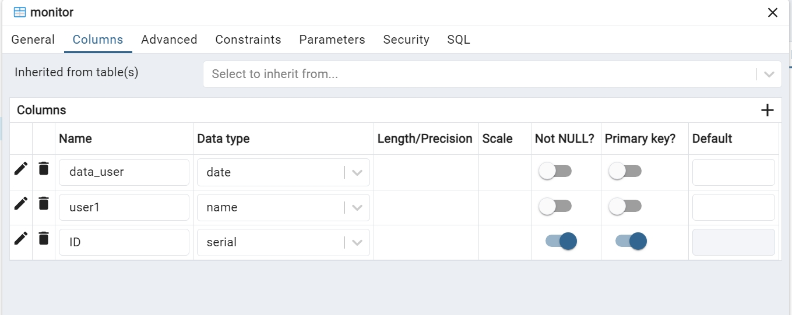
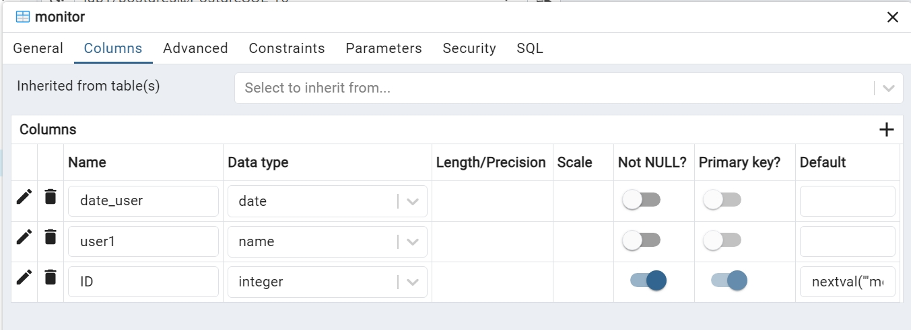
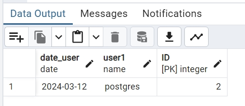
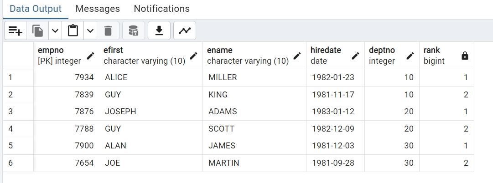
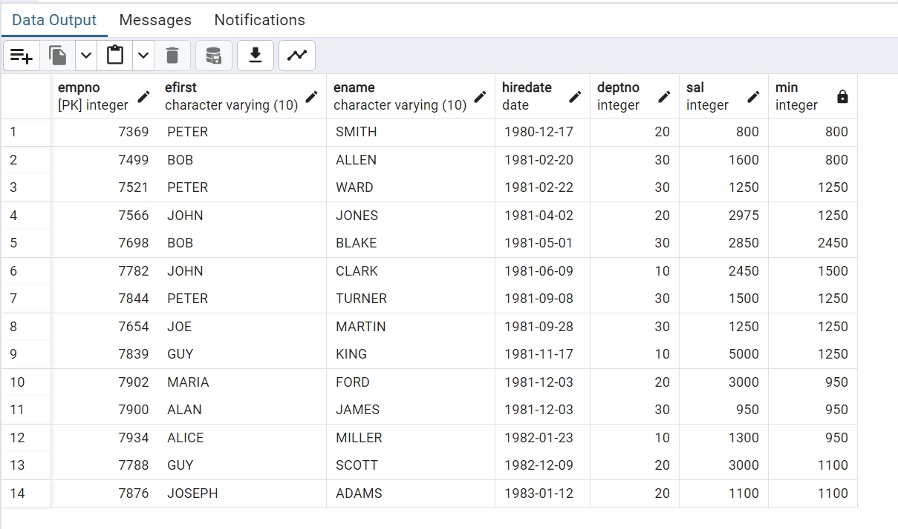
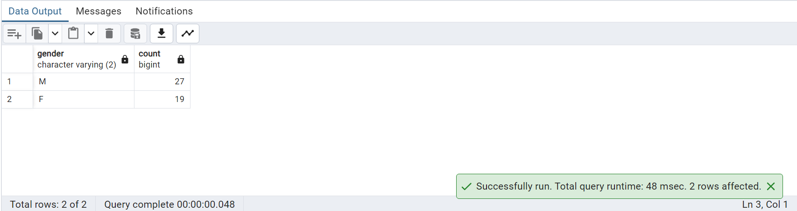
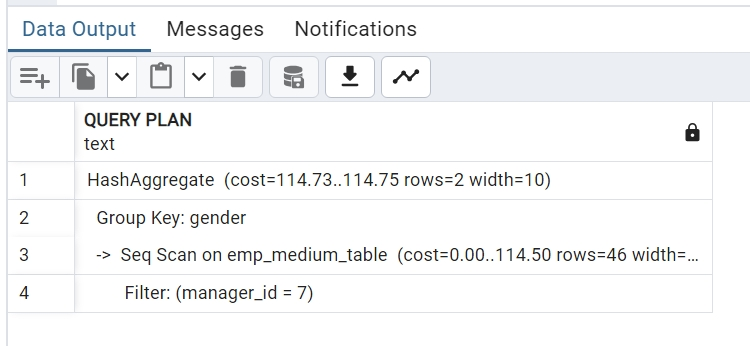

# Advanced Database - TP 2 - Part 2 PL/SQL

## Exercice 1. Functions

1. Create a function that gets an employee’s name from it’s empno. **[PPT-Cours 2 - PL _ SQL-P8]**

```
CREATE OR REPLACE PROCEDURE EXERSISE1(in_EMP_ID NUMERIC)
LANGUAGE plpgsql
AS $procedure$
DECLARE
    R_EMP EMP%ROWTYPE; 
BEGIN 
    SELECT * FROM EMP EMP WHERE EMPNO = in_emp_ID;
    --Print the employee name
    raise notice 'Employee Name : %, Employee Salary : %', 
    R_EMP.EFIRST, R_EMP.SAL;

END;
$procedure$
```

2. 验证: Procedures -> Script -> EXEC Script
Test the query with:
```
SELECT myFunction(7654) FROM DUAL;
```
```
CALL public.exersise1(
	--<IN in_emp_id numeric>
	7499
)
```

## Exercice 2. Procedure & Display & Cursors
Create a procedure that displays the net salary of this employee and the average salary of
employees doing the same job **[PPT-Cours 2 - PL _ SQL-P65]**

```
CREATE OR REPLACE PROCEDURE EXERSISE2(in_EMP_ID NUMERIC)
LANGUAGE plpgsql
AS $procedure$
DECLARE
    R_EMP EMP%ROWTYPE; 
	AVG_SAL  NUMERIC;
	
BEGIN 
    SELECT * FROM EMP EMP WHERE EMPNO = in_emp_ID;
	SELECT AVG(SAL) into AVG_SAL FROM EMP 
        WHERE JOB IN(SELECT JOB FROM EMP WHERE EMPNO = in_EMP_ID);
	raise notice 'Employee Name : %, Employee Salary : %', 
    R_EMP.EFIRST, R_EMP.SAL;
	--Print the AVG salary
	raise notice 'AVG of salary : % ', AVG_SAL;
EXCEPTION 
	WHEN OTHERS THEN 
	raise notice 'SQL ERROR OG QUERY : % ', SQLERRM;
END;
$procedure$
```
```
CALL public.exersise2(
	--<IN in_emp_id numeric>
	7499
)
```

## Exercice 5. SELECT for UPDATE
Change the commission for employees by putting them all to 0
Write the procedure UpdateCommission for modifying the commission of employees based on
their salary

- Sal<=1000 COMM=800
- Sal<=2000 COMM=1200
- Sal>2000 COMM=1500

Indications:


use the instruction “SELECT ... FROM table FOR UPDATE”

This will allow you to put a lock on the rows you want to update

The following statement specifies the current tuple to modify with an UPDATE or DELETE
WHERE CURRENT OF cursor **[PPT-Cours 2 - PL _ SQL- P43]**

```
UPDATE EMP SET COMM = 0;
```
MESSAGE -> UPDATE 14

```
UPDATE EMP SET COMM = 0;

CREATE OR REPLACE PROCEDURE EXERCISES()
language plpgsql
AS $procedure$

DECLARE
	ONE_EMP EMP%ROWTYPE;
	NEW_COMM numeric;
	E_SAL numeric;
	SAL_EMP CURSOR FOR SELECT * FROM EMP FOR UPDATE;
	
BEGIN
	--Open the cursor
	OPEN SAL_EMP;
	--Looping in the cursor
	LOOP
		FETCH SAL_EMP into ONE_EMP;
		EXIT WHEN NOT FOUND;
		--Cursor usage
		E_SAL := ONE_EMP.SAL;
		IF E_SAL <= 1000 THEN 
			NEW_COMM := 800;
		ELSE IF E_SAL <= 2000 THEN
			NEW_COMM := 1200;
		ELSE 
			NEW_COMM := 1500;
		END IF;
		END IF;
		
		UPDATE EMP SET COMM = NEW_COMM WHERE EMPNO = ONE_EMP.EMPNO;
		raise notice 'Empoyee Number; %, Employee Salary : %, New Commission: %,',
		ONE_EMP.EMPNO, ONE_EMP.SAL, NEW_COMM;
		
	END LOOP;
	--Closing the cursor
	CLOSE SAL_EMP;		

END
$procedure$
```
```
CALL public.exercise5()
```
```
SELECT * FOME public.emp
ORDER BY empno ASC
```

## Exercice 7. Triggers
The database administrator (DBA) wants to store the user who modifies (insert, delete, or update)
the EMP table and also the time of modification. **[PPT-Cours 2 - PL _ SQL- P49]**

1. Create The triggers: Set one or many triggers that can take into account these requirements.
Use the functions user() and sysdate() that can retrieve the name of the Oracle user and current
date and time respectively.

操作: Table -> Create -> 'monitor'



ID将自动生成数据模式:


```
CREATE OR REPLACE FUNCTION auto_insert() RETURNS TRIGGER AS $body$

BEGIN
raise notice 'user doing the motification : %', current_user;
raise notice 'date of motification : % ', current_date; 
insert into monitor(user1, date_user) VALUES (current_user, current_date);
RETURN NULL;
END
$body$
LANGUAGE plpgsql;

CREATE OR REPLACE TRIGGER MYTRIGGER
AFTER INSERT OR UPDATE OR DELETE ON EMP
EXECUTE PROCEDURE auto_insert();

UPDATE EMP
SET EFIRST = 'JEAN' WHERE EMPNO = 7369;

```


2. Function to analyze results: Write a function AnalyzeActivity that accepts a Oracle user name
and/or a date and calculate the number of operations performed by the user, whether for all the users during the specific day, or for the specific user on the specific day, or for a specific user since the table creation


# Advanced Database - TP 2 Advanced SQL

## Exercice 1. Analytics Queries . Window Queries
 
1. Gets the 2 persons per department, who have arrived the latest in the company.**[PPT-Cours 4 - Administration & Performance for Databases- P7]**

```
SELECT * FROM (
SELECT EMPNO, EFIRST, ENAME, HIREDATE, DEPTNO,
RANK() OVER (partition by DEPTNO order by HIREDATE desc) AS RANK
FROM EMP
)
WHERE RANK <= 2;
```



2. Show your analytical Skill and Invents an interesting query using Windows Functions (i.e.: a SELECT query on EMP table): The query should include the usage of “ROWS BETWEEN 1 PRECEDING AND 1 FOLLOWING”. **[PPT-Cours 4 - Administration & Performance for Databases- P10]**

```
SELECT EMPNO, EFIRST, ENAME, HIREDATE, DEPTNO, SAL,
 MIN (SAL) OVER (ORDER BY HIREDATE
ROWS BETWEEN 1 PRECEDING AND 1 FOLLOWING) AS min
FROM EMP
```



## Exercice 2. Index & Explain Plan
In this Exercise, we are going to use an Index to speed UP drastically a query.
We’ll see it’s difficult to take time into account for performance when analyzing a query. Because it depends on many factors: CPU, RAM, and most important if your results are already in CACHE or not (if you execute a query N time in a row, the first time it will be slow, then very quick because in CACHE).

->how to reduce
1. Execute this script (create 3 tables and load random data inside)
2. The goal of all exercice will be to tune the following query


3.	1) Use EXPLAIN plan to analyze the query
	
	
	2) Activate stats
	