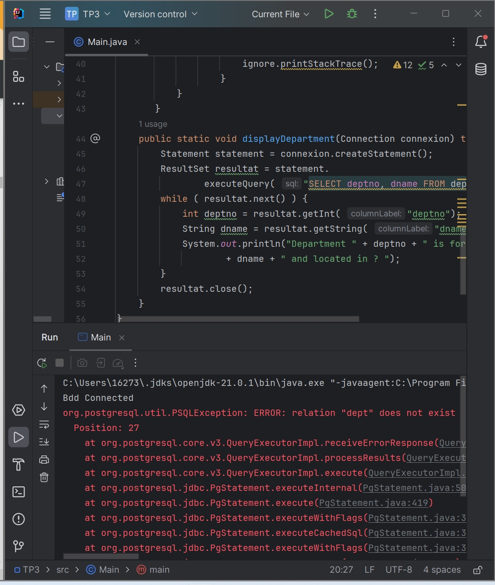
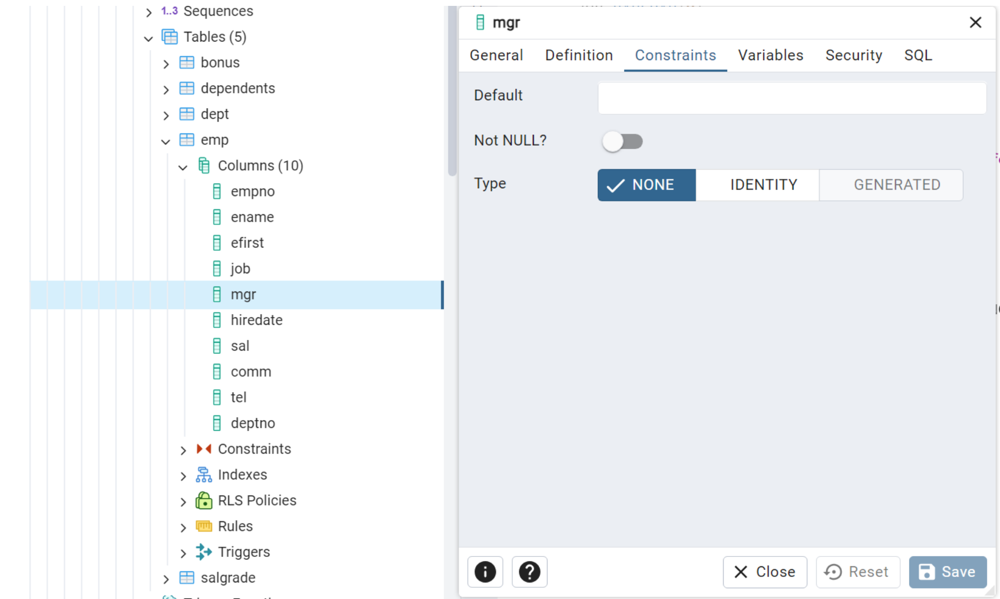
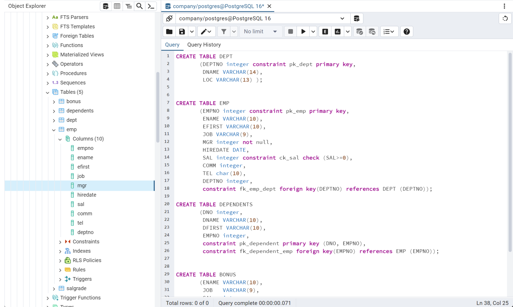
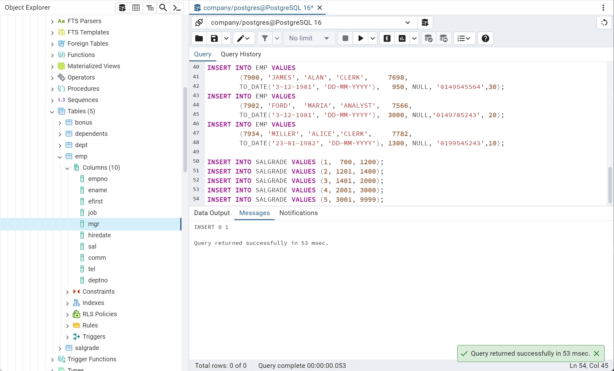
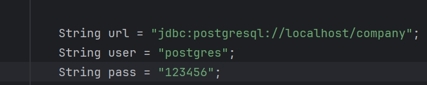
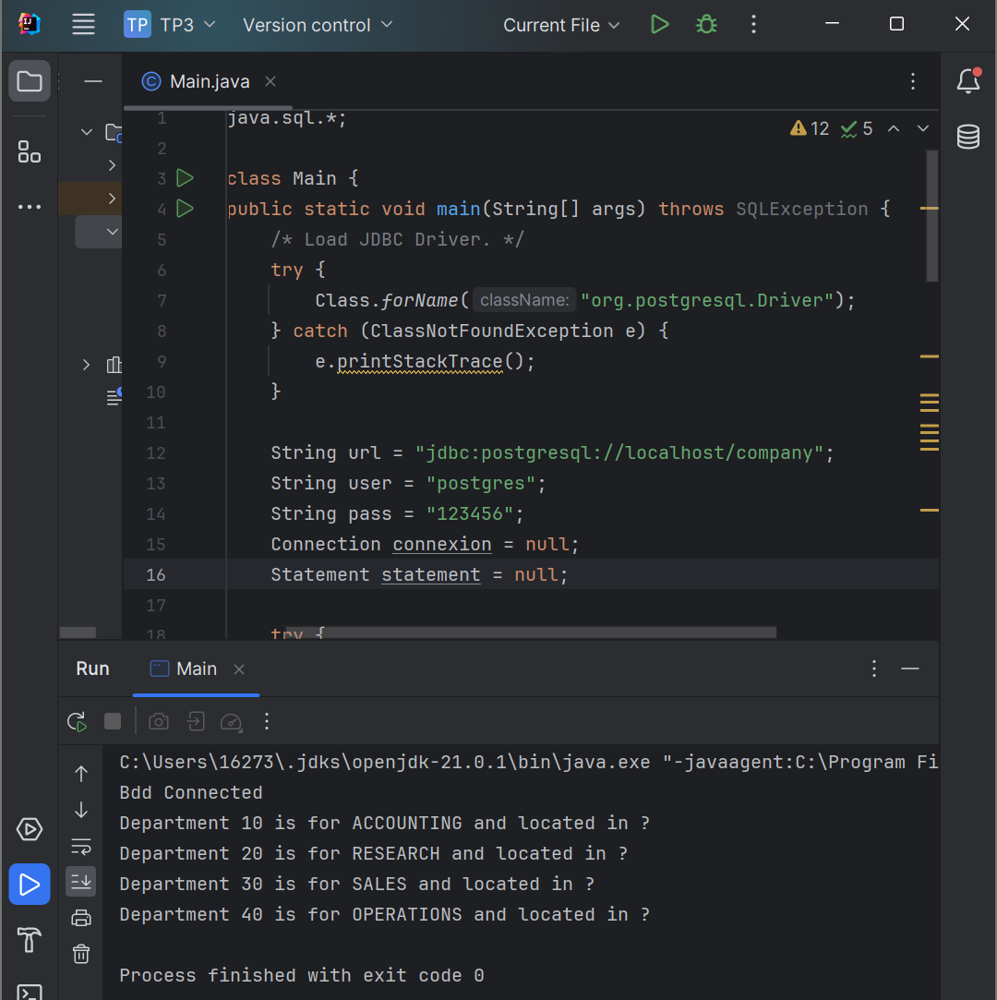
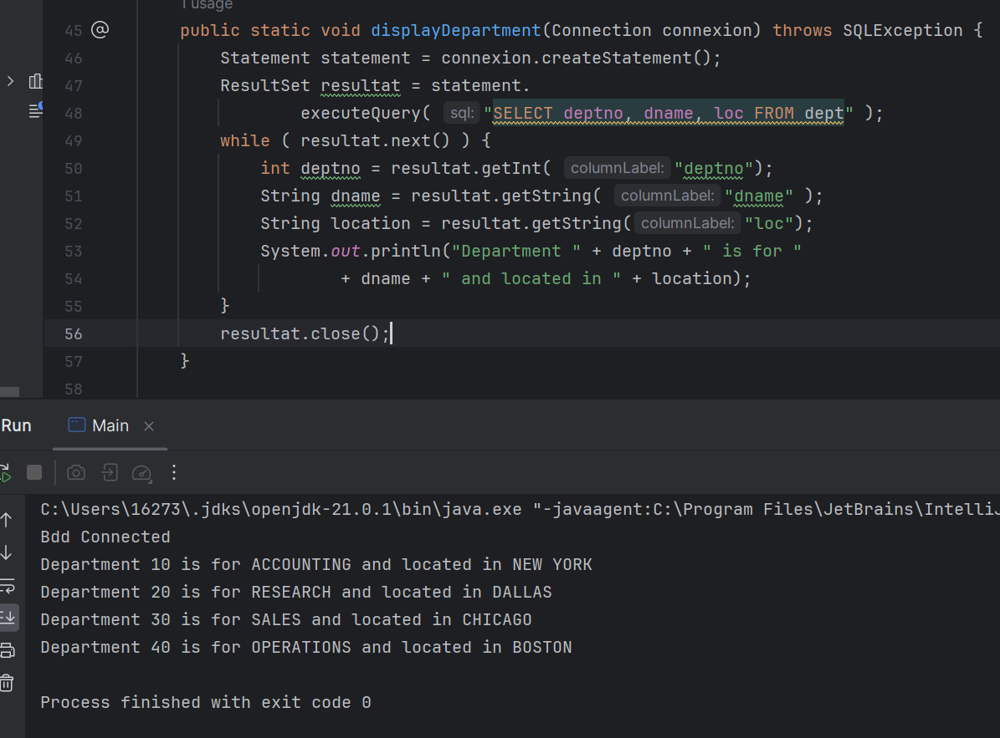
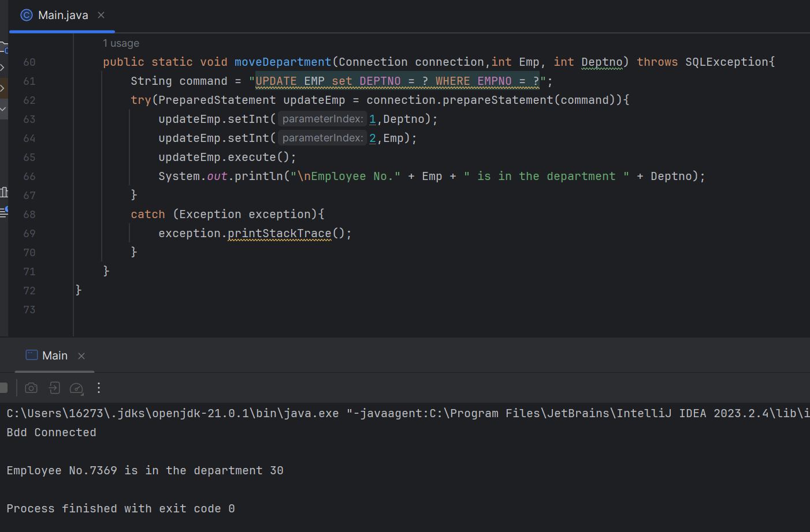

|APP|<-Connexing->|DB|
|-----------|
|Java|JDBS,DAO,JAP(API)|BOSTGRES|


# Part1
1.-3.
```
import java.sql.*;

public class Main {
       public static void main(String[] args) throws SQLException {
           /* Load JDBC Driver. */
           try {
               Class.forName("org.postgresql.Driver");
           } catch (ClassNotFoundException e) {
               e.printStackTrace();
           }

           String url = "jdbc:postgresql://localhost/postgres";
           String user = "postgres";
           String pass = "123456";
           Connection connexion = null;
           Statement statement = null;

           try {
               connexion = DriverManager.getConnection(url, user, pass);
               /* Requests to bdd will be here */
               System.out.println("Bdd Connected");

               statement = connexion.createStatement();

               displayDepartment(connexion);
           }
           catch (SQLException e) {
               e.printStackTrace();
           }
           finally {
               if (connexion != null)
                   try {
                       statement.close();
                   } catch (SQLException ignore) {
                       ignore.printStackTrace();
                   }
                   try {
                       connexion.close();
                   } catch (SQLException ignore) {
                       ignore.printStackTrace();
                   }
           }
       }
    public static void displayDepartment(Connection connexion) throws SQLException {
        Statement statement = connexion.createStatement();
        ResultSet resultat = statement.
                executeQuery( "SELECT deptno, dname FROM dept" );
        while ( resultat.next() ) {
            int deptno = resultat.getInt( "deptno");
            String dname = resultat.getString( "dname" );
            System.out.println("Department " + deptno + " is for "
                    + dname + " and located in ? ");
        }
        resultat.close();
    }
}
```
运行后结果：
```
Bdd Connected
org.postgresql.util.PSQLException: ERROR: relation "dept" does not exist
  Position: 27
```

- Create new Database -> "company"
- Query

- Close"NULL"

- Add table

- Add info

- Modifier the JAVA code -> link it to "company"

- Re-run the JAVA code


## Exercise 1: Modify the query above to add the location of the department
- Modifier the void code and re-run



## Exercice 2: Move Department
- add the move-function
```
public static void moveDepartment(Connection connection,int Emp, int Deptno) throws SQLException{
        String command = "UPDATE EMP set DEPTNO = ? WHERE EMPNO = ?";
        try(PreparedStatement updateEmp = connection.prepareStatement(command)){
            updateEmp.setInt(1,Deptno);
            updateEmp.setInt(2,Emp);
            updateEmp.execute();
            System.out.println("\nEmployee No." + Emp + " is in the department " + Deptno);
        }
        catch (Exception exception){
            exception.printStackTrace();
        }
    } 
```
- call the function in the Main
```
moveDepartment(connexion,7369,30);
```


# Part2
## Exercice 9 : Write the Bean for Department
DAO(abstract class) => (Interface)
- DAOEMP->MANAGE->EMP->EMP.data
- DAODEPT->DEPT->DEMP.data

## Exercice 10 : Write Implementation for method find for departement DAO.

