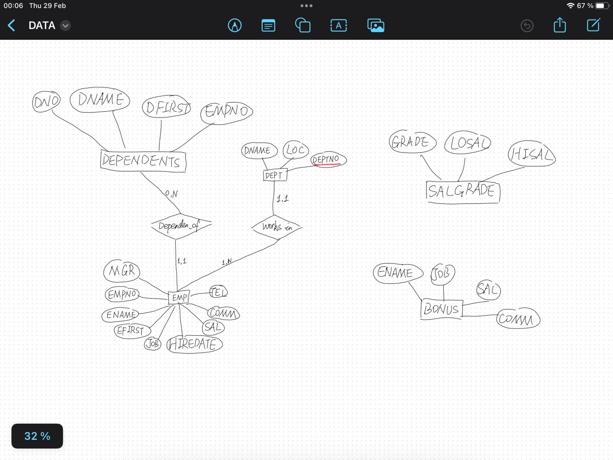

# Exercice 1

## 1. DDL queries 

```
CREATE TABLE DEPT
       (DEPTNO integer constraint pk_dept primary key,
        DNAME VARCHAR(14),
        LOC VARCHAR(13) );
 
  
CREATE TABLE EMP
       (EMPNO integer constraint pk_emp primary key,
        ENAME VARCHAR(10),
        EFIRST VARCHAR(10),
        JOB VARCHAR(9),
        MGR integer not null,
        HIREDATE DATE,
        SAL integer constraint ck_sal check (SAL>=0),
        COMM integer,
        TEL char(10),
        DEPTNO integer,
        constraint fk_emp_dept foreign key(DEPTNO) references DEPT (DEPTNO));
        
CREATE TABLE DEPENDENTS
       (DNO integer,
        DNAME VARCHAR(10),
        DFIRST VARCHAR(10),
		EMPNO integer,
		constraint pk_dependent primary key (DNO, EMPNO),
        constraint fk_dependent_emp foreign key(EMPNO) references EMP (EMPNO));
        
        
CREATE TABLE BONUS
       (ENAME VARCHAR(10),
        JOB   VARCHAR(9),
        SAL   integer,
        COMM  integer);
 
CREATE TABLE SALGRADE
        (GRADE integer,
         LOSAL integer,
         HISAL integer);
```

## 2. E/R diagram

Identify the different tables created and integrity constraints to ensure data consistency. Draw the entity / relational model from the given database.

Note: Dependents mean a person who depends on another person to be affiliated to the social Security System. In that case a dependent can be a child whose father is an employee (defined by empno link).


## 3. First integrity Constraint

Define an integrity constraint to prohibit the possibility of two employees to own the same firstname, lastname and phone number. Use the alter table statement.


```
ALTER TABLE EMP
ADD CONSTRAINT emp_unique UNIQUE(ENAME,EFIRST,TEL);
```

## 4. Second integrity Constraint
More and more employees have two phone numbers: a fixed and a mobile phone. Unfortunately, the database allows us to store one phone number. Bring the necessary modifications to the database. Set up an integrity constraint in order to make sure that the entered mobile number begins with 06. （此TP中由于数据库原因设为01）

```
ALTER TABLE EMP
ADD MOBILE_TEL CHAR(10);

ALTER TABLE EMP
ADD CONSTRAINT chk_mobile_tel CHECK (MOBILE_TEL LIKE '01%');
```

## 5. Third integrity Constraint On Delete
In practice, we realize that when one wants to delete an employee, it is necessary to remove all his dependents. How is it possible to make such removal dynamic? Do not forget to first remove the referential constraint fk_ depenent_emp that already exists. 

```
ALTER TABLE DEPENDENTS
DROP CONSTRAINT fk_dependent_emp;
```

```
ALTER TABLE DEPENDENTS
ADD CONSTRAINT fk_dependent_emp
foreign key(EMPNO) 
references EMP ON DELETE CASCADE;
```
ON DELETE CASCADE是在数据库中设置外键约束时使用的选项，它定义了当被参考表（父表）中的记录被删除时，对于包含被参考键（外键）的表（子表）中相关联的记录应如何处理的行为。具体来说，当您在一个外键约束中使用ON DELETE CASCADE时，意味着如果父表中的一条记录被删除，那么在子表中所有与之通过外键关联的记录也会被自动删除。

## 6. Explain Errors for Integrity Constraint
Fill the tables with the insert.sql script. Explain the errors that you could get and correct them.

```
INSERT INTO DEPT VALUES (10, 'ACCOUNTING', 'NEW YORK');
INSERT INTO DEPT VALUES (20, 'RESEARCH',   'DALLAS');
INSERT INTO DEPT VALUES (30, 'SALES',      'CHICAGO');
INSERT INTO DEPT VALUES (40, 'OPERATIONS', 'BOSTON');


INSERT INTO EMP VALUES
        (7369, 'SMITH', 'JOHN', 'CLERK',     7902,
        TO_DATE('17-12-1980', 'DD-MM-YYYY'),  800, NULL,'0149545243', 20);
INSERT INTO EMP VALUES
        (7499, 'ALLEN', 'BOB', 'SALESMAN',  7698,
        TO_DATE('20-02-1981', 'DD-MM-YYYY'), 1600,  300, '0149547243',30);
INSERT INTO EMP VALUES
        (7521, 'WARD',  'PETER', 'SALESMAN',  7698,
        TO_DATE('22-02-1981', 'DD-MM-YYYY'), 1250,  500, '0149545247',30);
INSERT INTO EMP VALUES
        (7566, 'JONES', 'JOHN', 'MANAGER',   7839,
        TO_DATE('2-04-1981', 'DD-MM-YYYY'),  2975, NULL, '0149545456',20);
INSERT INTO EMP VALUES
        (7654, 'MARTIN', 'JOE','SALESMAN',  7698,
        TO_DATE('28-09-1981', 'DD-MM-YYYY'), 1250, 1400, '0149545784',30);
INSERT INTO EMP VALUES
        (7698, 'BLAKE', 'BOB', 'MANAGER',   7839,
        TO_DATE('1-05-1981', 'DD-MM-YYYY'),  2850, NULL,'0149545254', 30);
INSERT INTO EMP VALUES
        (7782, 'CLARK', 'JOHN', 'MANAGER',   7839,
        TO_DATE('9-06-1981', 'DD-MM-YYYY'),  2450, NULL, '0149545245',10);
INSERT INTO EMP VALUES
        (7788, 'SCOTT', 'GUY', 'ANALYST',   7566,
        TO_DATE('09-12-1982', 'DD-MM-YYYY'), 3000, NULL,'0149545249', 20);
INSERT INTO EMP VALUES
        (7839, 'KING', 'GUY',  'PRESIDENT', NULL,
        TO_DATE('17-11-1981', 'DD-MM-YYYY'), 5000, NULL, '0149545241',10);
INSERT INTO EMP VALUES
        (7844, 'TURNER','PETER', 'SALESMAN',  7698,
        TO_DATE('8-09-1981', 'DD-MM-YYYY'),  1500,    0, '0149548243',30);
INSERT INTO EMP VALUES
        (7876, 'ADAMS', 'JOSEPH', 'CLERK',     7788,
        TO_DATE('12-01-1983', 'DD-MM-YYYY'), 1100, NULL,'0149565243', 20);
INSERT INTO EMP VALUES
        (7900, 'JAMES', 'ALAN', 'CLERK',     7698,
        TO_DATE('3-12-1981', 'DD-MM-YYYY'),   950, NULL, '0149545564',30);
INSERT INTO EMP VALUES
        (7902, 'FORD',  'MARIA', 'ANALYST',   7566,
        TO_DATE('3-12-1981', 'DD-MM-YYYY'),  3000, NULL,'0149785243', 20);
INSERT INTO EMP VALUES
        (7934, 'MILLER', 'ALICE','CLERK',     7782,
        TO_DATE('23-01-1982', 'DD-MM-YYYY'), 1300, NULL, '0199545243',10); 

INSERT INTO SALGRADE VALUES (1,  700, 1200);
INSERT INTO SALGRADE VALUES (2, 1201, 1400);
INSERT INTO SALGRADE VALUES (3, 1401, 2000);
INSERT INTO SALGRADE VALUES (4, 2001, 3000);
INSERT INTO SALGRADE VALUES (5, 3001, 9999);
```

直接运行会发现由于存在null信息，故需要如下操作后重新运行：

```
ALTER TABLE EMP
ALTER COLUMN MGR DROP NOT NULL;
```

**ALTER COLUMN MGR DROP NOT NULL**用于修改数据库表中的列属性。这个特定的语句是用来移除EMP表中MGR列上的NOT NULL约束的。在SQL中，NOT NULL约束是用来确保一个列不能包含空值（NULL）的，即该列在每一行中都必须有一个值。

salgrade->view data可查结果

## 7. Define a sequence 
to make easy creation of a new dependent. This sequence has to start with the value 8000 and an increment gap of 1.

The instruction to create a sequence:
 CREATE SEQUENCE ma_sequence [START WITH] ... [INCREMENT BY]... [MINVALUE]...[MAXVALUE]...[CYCLE|NOCYCLE];


```
CREATE SEQUENCE SequenceDepl
START with 8000
INCREMENT BY 1
```

```
SELECT nextval('SequenceDepl');
INSERT INTO DEPENDENTS VALUES (NEXTVAL('SequenceDepl'),'xxx','yyy',7654);
```

# Exercise 2
DML queries Answer the following queries using SQL.

1. List the content of all tables to see the attributes names 

```
SELECT table_name FROM information_schema.tables where table_schema = 'public';
```

2. Select employees whose commission is higher than their salary 

```
SELECT * FROM EMP 
WHERE COMN > SAL;
```

3. Select employees earning between 1200 and 2400  (earning is sal + commision)

```
SELECT * FROM EMP 
WHERE (SAL + COALESCE(COMM, 0)) BETWEEN 1200 AND 2400;
```

4. Select employees who are CLERK or ANALYST 

```
SELECT * FROM EMP 
WHERE JOB IN ('CLERK', 'ANALYST');
```

5. Select employees whose name begins by M 

```
SELECT * FROM EMP 
WHERE ENAME LIKE 'M%';
```

6. Select employees whose name includes a L in second position 

```
SELECT * FROM EMP 
WHERE ENAME LIKE '_L%';
```

7. Select employees who are MANAGER or CLERK in the department 10 and whose salary is greater than 1500 

```
SELECT * FROM EMP 
WHERE JOB IN ('MANAGER','CLERK') AND DEPTNO = 10 AND SAL > 1500;
```

8. Select employees whose commission is NULL 

```
SELECT * FROM EMP
WHERE COMM IS NULL;
```

9. Select employees by ascending order (by hiredate)

```
SELECT * FROM EMP
ORDER BY HIREDATE ASC;
```

10. Select employees ordered by job, and for each job, by decreasing salary 

```
SELECT * FROM EMP 
ORDER BY JOB asc,
SAL DESC;
```

11. Select departments without employees 

```
SELECT * FROM DEPT 
WHERE DEPTNO 
NOT IN (SELECT DEPTNO FROM EMP);
```

12. List employees indicating for each the name of his/her manager 

```
SELECT E.EMPNO, E.ENAME, M.ENAME AS MANAGER_NAME
FROM EMP E
LEFT JOIN EMP M ON E.MGR = M.EMPNO;
```

13. List employees earning more than JONES 

```
SELECT * FROM EMP
WHERE (SAL + COALESCE(COMM, 0))  > (SELECT (SAL + COALESCE(COMM, 0))  FROM EMP WHERE ENAME = 'JONES')
```

14. List employees displaying in the same column salary and commission 

```
SELECT EMPNO, ENAME, SAL, COMM, CONCAT(SAL, ' / ', COALESCE(COMM, 'N/A')) AS SAL_COMM
FROM EMP;
```

15. List department numbers which are both in table EMP and in table DEPT 

```
SELECT DISTINCT DEPTNO
FROM EMP
WHERE DEPTNO IN (SELECT DEPTNO FROM DEPT);
```

16. List employees working in CHICAGO and having the same job than JONES 

```
SELECT E.* FROM EMP E
JOIN DEPT D ON E.DEPTNO = D.DEPTNO
WHERE D.LOC = 'CHICAGO' AND E.JOB = (SELECT JOB FROM EMP WHERE ENAME = 'JONES');
```

17. List employees who don't work in the same department than their manager 

```
SELECT e.* FROM EMP e
LEFT JOIN EMP b on e.MGR = b.EMPNO
WHERE e.DEPTNO <> b.DEPTNO
```
**左连接（LEFT JOIN）**
1. FROM EMP e：这里，EMP表被别名为e，表示查询的主体对象，即员工。
2. LEFT JOIN EMP b ON e.MGR = b.EMPNO：EMP表再次被引用并被别名为b，表示员工的经理。左连接（LEFT JOIN）确保了即使某些员工没有经理（即，如果e.MGR在EMP表中没有对应的EMPNO），这些员工的记录也会出现在结果集中。这里，连接条件是基于员工的MGR字段与经理的EMPNO字段相匹配。

**筛选条件**
1. WHERE e.DEPTNO <> b.DEPTNO：这个条件用于筛选那些员工和他们经理所在部门编号不同的记录。
2. <>是SQL中表示“不等于”的操作符。因此，这个条件排除了那些与他们的经理在同一个部门的员工，只留下了部门编号不同的那些员工记录。

18. List employees working in a department having at least one CLERK 

```
SELECT * FROM EMP
WHERE DEPTNO IN (SELECT DEPTNO FROM EMP WHERE JOB = 'CLERK');
```

19. List employees of department 10 having the same job than someone from the department SALES

```
SELECT *
FROM EMP
WHERE JOB IN (SELECT JOB FROM EMP WHERE DEPTNO = (SELECT DEPTNO FROM DEPT WHERE DNAME = 'SALES')) AND DEPTNO = 10;
```

20. List employees having the same job than JONES or a salary greater than FORD's salary 

```
SELECT *
FROM EMP
WHERE JOB = (SELECT JOB FROM EMP WHERE ENAME = 'JONES')
OR SAL > (SELECT SAL FROM EMP WHERE ENAME = 'FORD');
```

21. List employees having a salary greater than all employees of department 20

```
SELECT E1.ENAME, E1.ENAME, E1.TEL, E2.ENAME AS MANAGER
FROM EMP E1 INNER JOIN EMP E2 ON E1.MGR = E2.EMPNO;
```
