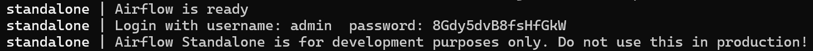
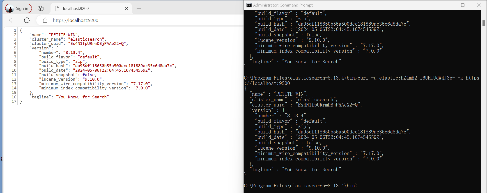

# Install Airflow (With Windows)
1. InstallWindows Subsystem for Linux:

https://docs.microsoft.com/fr-fr/windows/wsl/install

2. Open linux console and write this:

```
sudo apt-get update
sudo apt install python3-venv
python3 -m venv airflow_venv
cd airflow_venv
source bin/activate
pip3 install "apache-airflow==2.7.3"
export PATH=/home/[USER]/.local/bin/:$PATH
```

出现以下报错：
```
ModuleNotFoundError: No module named 'flask_session.sessions'
```
解决方法：安装旧版本库
```
(airflow_venv) gxf@Petite-win:~$ pip install flask-session==0.4.0
```
重新初始化：
```
(airflow_venv) gxf@Petite-win:~$ source airflow_venv/bin/activate
(airflow_venv) gxf@Petite-win:~$ airflow db init
```
有警告（不必理会）：
/home/gxf/airflow_venv/lib/python3.10/site-packages/airflow/cli/commands/db_command.py:43 DeprecationWarning: `db init` is deprecated.  Use `db migrate` instead to migrate the db and/or airflow connections create-default-connections to create the default connections

3. Launch Airflow

Launch an Airflow as a standalone server:
```
(airflow_venv) gxf@Petite-win:~$ airflow standalone
```
结果：

```
standalone | Airflow is ready
standalone | Login with username: admin  password: 8Gdy5dvB8fsHfGkW
standalone | Airflow Standalone is for development purposes only. Do not use this in production!
```

# ELK Stack
ELK Stack 是一个缩略词，用来描述由三个常见项目组成的堆栈：Elasticsearch、Logstash 和Kibana。 ELK Stack 通常被称为Elasticsearch
- 能够聚合来自所有系统和应用程序的日志，分析这些日志，并创建可视化来进行应用程序和基础设施监控、更快的故障排除、安全分析等。
- 能够安全可靠地从任何来源获取任何格式的数据，然后对数据进行搜索、分析和可视化。

- *IN THIS PROJECT JUST USE E&K 
    DBMS + Search Engine(Text Indexes)
    - Lucene: Java Library

## Install Elastic
1. download&extract and run
```
cd "C:\Program Files\elasticsearch-8.13.4\bin"
C:\Program Files\elasticsearch-8.13.4\bin>elasticsearch.bat
```
2. 重置密码
```
C:\Program Files\elasticsearch-8.13.4\bin>elasticsearch-reset-password -u elastic
warning: ignoring JAVA_HOME=C:\Program Files\Java\jdk-21; using bundled JDK
```
3. 证书始终显示有问题，尝试过添加根目录授权证书方式等依旧无法成功验证，遂选择跳过方式进行连接：
```
C:\Program Files\elasticsearch-8.13.4\bin>curl -u elastic:hZ4mH2=i6UHTUdW4J3e- -k https://localhost:9200
```
4. 登录：
```
URL: https://localhost:9200
name: elastic
password:第二步所查找结果，如：

C:\Program Files\elasticsearch-8.13.4\bin>elasticsearch-reset-password -u elastic
warning: ignoring JAVA_HOME=C:\Program Files\Java\jdk-21; using bundled JDK
This tool will reset the password of the [elastic] user to an autogenerated value.
The password will be printed in the console.
Please confirm that you would like to continue [y/N]y
Password for the [elastic] user successfully reset.
New value: hZ4mH2=i6UHTUdW4J3e-
```
5. 结果如下


# Install Kibana
1. download and change some info in kibana.yml:
```
#server.port: 5601
#server.host: "localhost"
#server.name: "my-kibana"
#elasticsearch.hosts: ["http://localhost:9200"]
#elasticsearch.username: "elastic"
#elasticsearch.password: "hZ4mH2=i6UHTUdW4J3e-"
#elasticsearch.ssl.verificationMode: none
```
2. run 
```
C:\>cd "C:\Program Files\kibana-8.13.4\bin"
C:\Program Files\kibana-8.13.4\bin>kibana.bat
```
3. 查找令牌
```
C:\Program Files\elasticsearch-8.13.4\bin>elasticsearch-create-enrollment-token -s kibana
```
4. 输入令牌及验证码
```
http://localhost:5601/
```

# SPARK
## 安装
1. download: https://spark.apache.org/downloads.html
2. 配置环境变量
    - 在系统变量中，点击“新建”，创建一个新的环境变量：
        -  变量名：SPARK_HOME
        - 变量值：C:\Program Files\spark-3.5.1-bin-hadoop3
        
3. 启动PySpark Shell：
管理员身份运行Command：
```
pysaprk
```

## 读取文件信息
1. 运行文件读取指令，无法执行：
    1. 需确认Python版本，此次更改版本回溯
        ```
        C:\Users\16273>where python
        C:\Users\16273\AppData\Local\Programs\Python\Python39\python.exe
        C:\Users\16273\Python\python.exe
        C:\Users\16273\AppData\Local\Microsoft\WindowsApps\python.exe

        C:\Users\16273>python --version
        Python 3.9.6
        ```
        
    2. 下载winutils.exe，并添加至路径"C:\Program Files\spark-3.5.1-bin-hadoop3\bin\winutils.exe"
    3. 在cmd中配置
        ```
        C:\Users\16273>set PYSPARK_PYTHON=C:\Users\16273\AppData\Local\Programs\Python\Python39\python.exe

        C:\Users\16273>set PYSPARK_DRIVER_PYTHON=C:\Users\16273\AppData\Local\Programs\Python\Python39\python.exe

        C:\Users\16273>set HADOOP_HOME=C:\Program Files\spark-3.5.1-bin-hadoop3

        C:\Users\16273>set PATH=%PATH%;%HADOOP_HOME%\bin

        C:\Users\16273>pyspark
        ```
2. 运行指令读取文件信息
```
>>> rdd = sc.textFile("C:\\Program Files\\spark-3.5.1-bin-hadoop3\\README.md")
>>> df = rdd.toDF()
```
指令后报错:
```
pyspark.errors.exceptions.base.PySparkTypeError: [CANNOT_INFER_SCHEMA_FOR_TYPE] Can not infer schema for type: `str`.
```
这个错误是由于尝试将 RDD 直接转换为 DataFrame 而没有提供 schema 导致的。为了将一个 RDD 转换为 DataFrame，你需要指定 schema，或在 RDD 中包含结构化数据（例如 JSON 或 Row 对象）。在这种情况下，可以通过将每行数据转换为 Row 对象来解决问题。
重新运行以下指令：
```
>>> from pyspark.sql import Row
>>> rdd = sc.textFile("C:\\Program Files\\spark-3.5.1-bin-hadoop3\\README.md")
>>> row_rdd = rdd.map(lambda line: Row(line=line))
>>> df = spark.createDataFrame(row_rdd)
>>> df.show()
```


## Spark UI
1. 完成以上步骤后进入网址 http://localhost:4040/jobs/


## Transformations & Actions
### Transfotmation
- 定义：转换操作是从现有的 RDD（弹性分布式数据集）生成新 RDD 的函数。它将 RDD 作为输入，生成一个或多个新的 RDD 作为输出。
- 特点：转换操作是惰性计算的，这意味着它们不会立即执行，直到一个行动操作触发它们的执行。
- 示例：dataMultiplied2 = rdd.filter(lambda x: x*2)：这段代码对 RDD 进行过滤操作，将 RDD 中的每个元素乘以 2，生成一个新的 RDD。

### Actions
- 定义：行动操作是那些生成非 RDD 值的操作。它们会在 Spark 程序中物化一个值。换句话说，任何返回非 RDD 值的 RDD 操作都是一个行动。
- 特点：行动操作会触发实际计算（包括之前定义的所有转换操作）。
- 示例：dataMultiplied2.saveAsTextFile("/path/to/saved/file")：这段代码将 RDD 保存到指定路径的文件中。

## 示例
```
//启动Spark后
//从本地文件系统读取文件并创建 RDD：
# 读取文件并创建 RDD
>>> data = sc.textFile("C:\\Program Files\\spark-3.5.1-bin-hadoop3\\README.md")
# 显示 RDD 内容的前几行
>>> data.take(5)
//通过并行化集合创建 RDD
# 创建 RDD 通过并行化集合
>>> numbers = [1, 2, 3, 4, 5, 6, 7, 8, 9, 10]
>>> numbersDataRDD = sc.parallelize(numbers)
# 显示 RDD 内容
>>> numbersDataRDD.collect()
[1, 2, 3, 4, 5, 6, 7, 8, 9, 10]
//从现有的 RDD 创建新的 RDD（应用转换操作）
# 应用 map 转换操作，将每个元素乘以 2
>>> newRDD = numbersDataRDD.map(lambda data: data * 2)
# 应用 filter 转换操作，过滤出大于 4 的元素
>>> newRDDFiltered = numbersDataRDD.filter(lambda data: data > 4)
# 执行动作操作，触发计算并收集结果
>>> result = newRDD.collect()
>>> print("Result of newRDD:", result)
>>> filtered_result = newRDDFiltered.collect()
>>> print("Result of newRDDFiltered:", filtered_result)
```


刷新 http://localhost:4040 得到如下结果:


## Partitions
```
//查看默认分区数
# 读取文件并创建 RDD
>>> data = sc.textFile("C:\\Program Files\\spark-3.5.1-bin-hadoop3\\README.md")
# 查看默认分区数
>>> num_partitions = data.getNumPartitions()
>>> print(f"Default number of partitions: {num_partitions}")

//指定分区数读取文件
# 读取文件时指定分区数为 10
>>> data_with_partitions = sc.textFile("C:\\Program Files\\spark-3.5.1-bin-hadoop3\\README.md", 10)
# 查看指定分区数
>>> num_partitions_specified = data_with_partitions.getNumPartitions()
>>> print(f"Number of partitions specified: {num_partitions_specified}")
//进行分区操作并过滤包含指定字符串的行，读取文件时指定分区数为 15
>>> data_with_more_partitions = sc.textFile("C:\\Program Files\\spark-3.5.1-bin-hadoop3\\README.md", 15)
# 过滤包含字符串 "the" 的行
>>> filtered_data = data_with_more_partitions.filter(lambda x: "the" in x)
# 收集过滤后的结果
>>> result = filtered_data.collect()
>>> print(result)
```

刷新 http://localhost:4040 得到如下结果:


