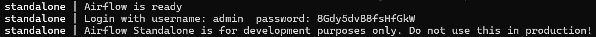
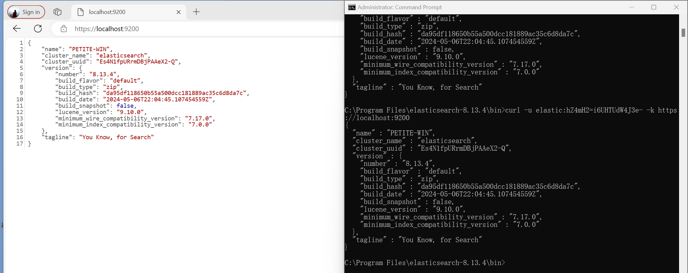

# Install Airflow (With Windows)
1. InstallWindows Subsystem for Linux:

https://docs.microsoft.com/fr-fr/windows/wsl/install

2. Open linux console and write this:

```
sudo apt-get update
sudo apt install python3-venv
python3 -m venv airflow_venv
cd airflow_venv
source bin/activate
pip3 install "apache-airflow==2.7.3"
export PATH=/home/[USER]/.local/bin/:$PATH
```

出现以下报错：
```
ModuleNotFoundError: No module named 'flask_session.sessions'
```
解决方法：安装旧版本库
```
(airflow_venv) gxf@Petite-win:~$ pip install flask-session==0.4.0
```
重新初始化：
```
(airflow_venv) gxf@Petite-win:~$ source airflow_venv/bin/activate
(airflow_venv) gxf@Petite-win:~$ airflow db init
```
有警告（不必理会）：
/home/gxf/airflow_venv/lib/python3.10/site-packages/airflow/cli/commands/db_command.py:43 DeprecationWarning: `db init` is deprecated.  Use `db migrate` instead to migrate the db and/or airflow connections create-default-connections to create the default connections

3. Launch Airflow

Launch an Airflow as a standalone server:
```
(airflow_venv) gxf@Petite-win:~$ airflow standalone
```
结果：

```
standalone | Airflow is ready
standalone | Login with username: admin  password: 8Gdy5dvB8fsHfGkW
standalone | Airflow Standalone is for development purposes only. Do not use this in production!
```

# ELK Stack
ELK Stack 是一个缩略词，用来描述由三个常见项目组成的堆栈：Elasticsearch、Logstash 和Kibana。 ELK Stack 通常被称为Elasticsearch
- 能够聚合来自所有系统和应用程序的日志，分析这些日志，并创建可视化来进行应用程序和基础设施监控、更快的故障排除、安全分析等。
- 能够安全可靠地从任何来源获取任何格式的数据，然后对数据进行搜索、分析和可视化。

- *IN THIS PROJECT JUST USE E&K 
    DBMS + Search Engine(Text Indexes)
    - Lucene: Java Library

## Install Elastic
1. download&extract and run
```
cd "C:\Program Files\elasticsearch-8.13.4\bin"
C:\Program Files\elasticsearch-8.13.4\bin>elasticsearch.bat
```
2. 重置密码
```
C:\Program Files\elasticsearch-8.13.4\bin>elasticsearch-reset-password -u elastic
warning: ignoring JAVA_HOME=C:\Program Files\Java\jdk-21; using bundled JDK
```
3. 证书始终显示有问题，尝试过添加根目录授权证书方式等依旧无法成功验证，遂选择跳过方式进行连接：
```
C:\Program Files\elasticsearch-8.13.4\bin>curl -u elastic:hZ4mH2=i6UHTUdW4J3e- -k https://localhost:9200
```
4. 登录：
```
URL: https://localhost:9200
name: elastic
password:第二步所查找结果，如：

C:\Program Files\elasticsearch-8.13.4\bin>elasticsearch-reset-password -u elastic
warning: ignoring JAVA_HOME=C:\Program Files\Java\jdk-21; using bundled JDK
This tool will reset the password of the [elastic] user to an autogenerated value.
The password will be printed in the console.
Please confirm that you would like to continue [y/N]y
Password for the [elastic] user successfully reset.
New value: hZ4mH2=i6UHTUdW4J3e-
```
5. 结果如下


# Install Kibana
1. download and change some info in kibana.yml:
```
#server.port: 5601
#server.host: "localhost"
#server.name: "my-kibana"
#elasticsearch.hosts: ["http://localhost:9200"]
#elasticsearch.username: "elastic"
#elasticsearch.password: "hZ4mH2=i6UHTUdW4J3e-"
#elasticsearch.ssl.verificationMode: none
```
2. run 
```
C:\>cd "C:\Program Files\kibana-8.13.4\bin"
C:\Program Files\kibana-8.13.4\bin>kibana.bat
```
3. 查找令牌
```
C:\Program Files\elasticsearch-8.13.4\bin>elasticsearch-create-enrollment-token -s kibana
```
4. 输入令牌及验证码
```
http://localhost:5601/
```
