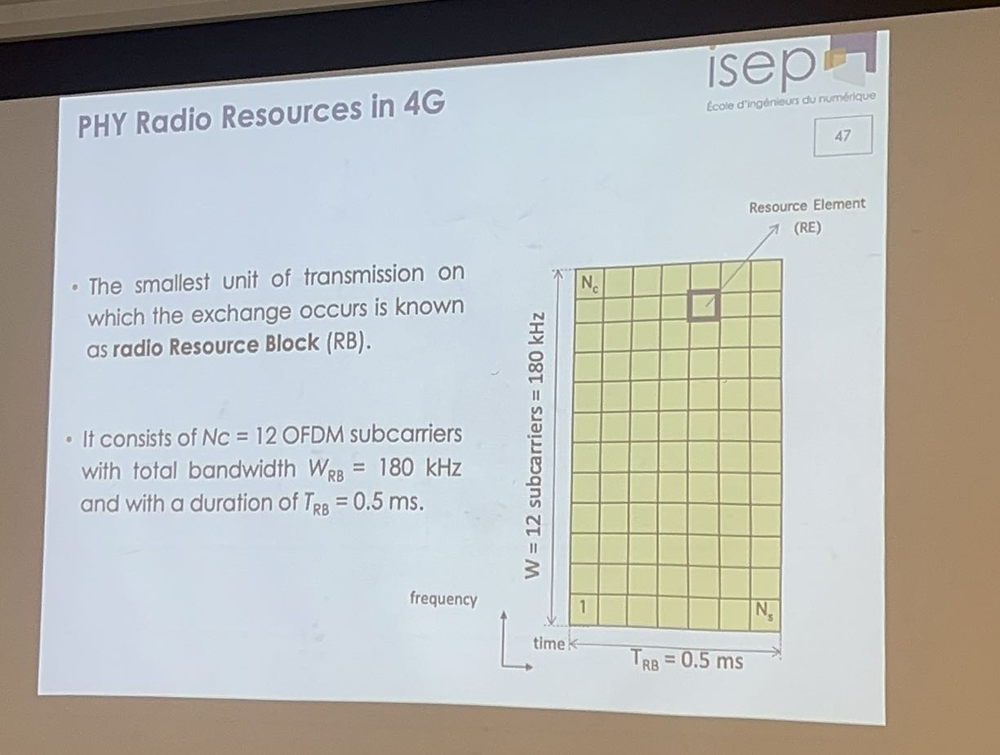

1. - SaaS = Software as Service
    - IaaS = Infrastructure as Service
    - PaaS = Platform as Service
2. Internet => Consult Data / Mails / Search
    - Contant of Internet is generaled by human => Social NTW
    - Human : Graphical Interface / Native language
    - Content of Internet => Things / Machine
3. Indirect Network Topology 
    - Non direct communication through a **Gateway**
    
   Things => Local Network => -Gateways Parallel- => Internet => Back-End Services

    - **No-IP Use case**: The gateway will play the interface between the non-IP and the IP world when non-IP based application is used at the devices.
        1) @Local Address => [Bluetooth,wifi,....]
        2) [IP Gateway]@IP
        3) IP NTW
4. BLE[Phone]/Wifi[Computer]/Zigbee

5. RFID(Radio Frequency Identification)又称无线射频识别，是一种通信技术，可通过无线电讯号识别特定目标并读写相关数据,RFID处于感知层.

    - Bobine : Not Power

    一套完整RFID硬件统由Reader与Transponder两部份组成.
    
    其原理为:
    - 由Reader发射一特定频率的无线电波能量给Transponder
    - 用以驱动Transponder电路将內部的ID Code送出
    - 由Reader接收此ID Code
    
    Transponder的特殊在于免用电池、免接触、免刷卡故不怕脏污，且晶片密码为世界唯一无法复制，安全性高、长寿命

https://zhuanlan.zhihu.com/p/385015812#Rfid%E7%9A%84%E5%9F%BA%E6%9C%AC%E6%A6%82%E5%BF%B5

6. Indirect Network Topology with MQTT (Message Queuing Telemetry Transport)

    subscring -> [-Group/Meet up Group/ Administrators-]administrators do publish -> get notify

https://zhuanlan.zhihu.com/p/421109780

7. 1) Critical IoT Licensed Band
    - Real time
    - Critical application
    - Low data rate
    - High reliability
    - Low latency
    - Mobility & Roaming

    2) Massive IoT Unlicensed Band
    - Non real time
    - Non critical
    - Very Low data rate
    - Low cost
    - Low power consumption

8. Two Business Models
    1) Wide Area Network with national coverage
    2) Private Network

9. Communication Protocols

    LoRaWAN class A-B-C

10. Modulation of LoRa
$$2^{SF} = B*T$$

LoRa（Long Range）是一种低功耗广域网（LPWAN）技术，广泛应用于物联网（IoT）项目中，其核心在于提供远距离通信能力同时保持较低的功耗。LoRa的调制技术是其关键特性之一，允许它在噪声环境下保持高效的数据传输。在LoRa调制中，一个重要的概念是扩频因子（Spreading Factor，SF）。

给出的公式$2^{SF} = B*T$直观地展示了扩频因子（SF）、带宽（B）和符号时间（T）之间的关系。这里的意义分解如下：

- **\(2^{SF}\)**: 扩频因子（SF）的值定义了每个符号的编码位数。在LoRa调制中，SF的取值范围通常是从7到12。\(2^{SF}\)表达的是每个LoRa符号可以携带的不同状态的数量，或者说是每个符号的正交性。扩频因子越大，每个符号能携带的信息量就越多，但同时也意味着发送同样量的数据需要更长的时间，因此会减少数据率并增加通信的时间。

- **B**: 表示LoRa信号的带宽，单位是赫兹（Hz）。带宽是信号在频域的宽度，直接影响到数据传输速率和通信距离。在LoRa技术中，常见的带宽设置有125 kHz、250 kHz和500 kHz等。

- **T**: 符号时间，即传输单个LoRa符号所需的时间，单位是秒（s）。符号时间T是SF和带宽B的函数，反映了在给定扩频因子和带宽下，传输一个符号需要多少时间。随着SF的增加，符号时间也会增加，这意味着数据传输速率会降低，但能够提高信号的传输距离和抗干扰能力。

简而言之，这个公式展示了在LoRa通信中，扩频因子SF、带宽B和符号时间T三者之间的关系。通过调整这些参数，可以根据实际应用场景的需求（如距离、数据率和能耗）来优化LoRa通信系统的性能。

11. MTC: machine type communication

12. 

13. 
