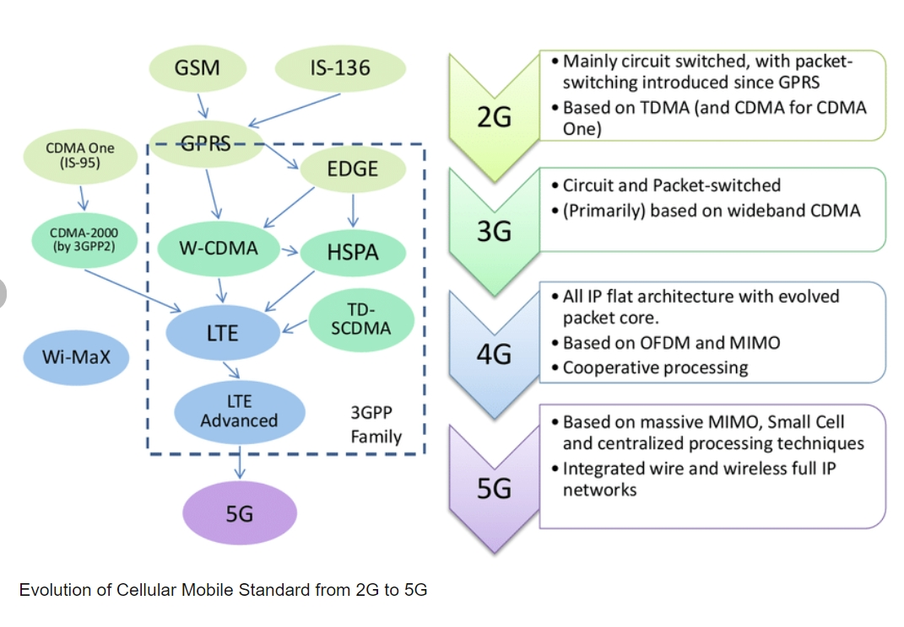
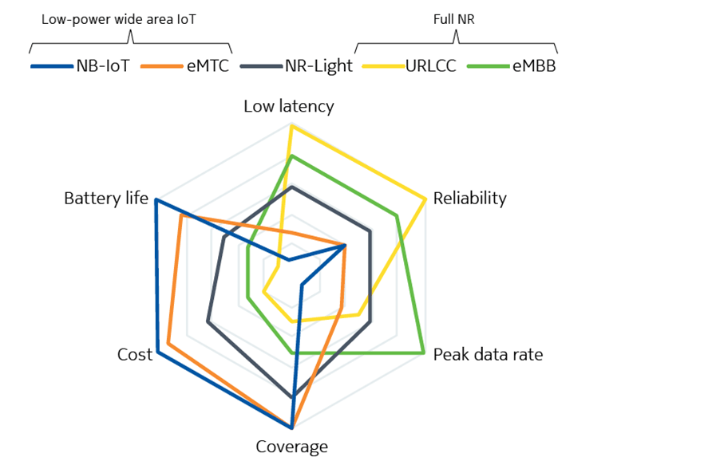
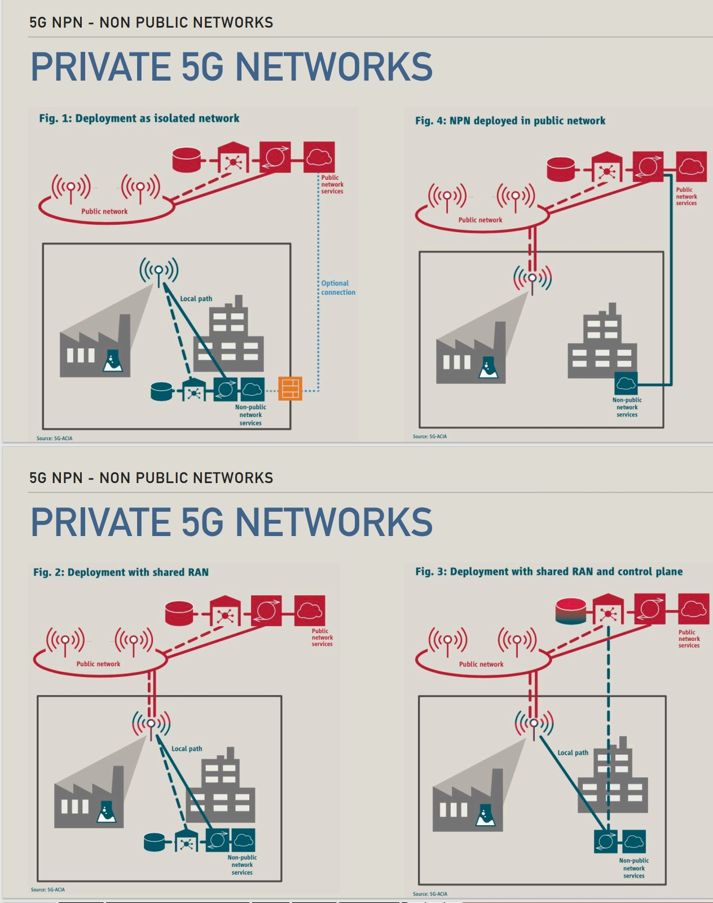

1. MQTT: 消息队列遥测传输（英语：Message Queuing Telemetry Transport，MQTT）是ISO 标准（ISO/IEC PRF 20922）下基于发布（Publish）/订阅（Subscribe）范式的消息协议，可视为“资料传递的桥梁”。它工作在TCP/IP协议族上，是为硬件性能低下的远程设备以及网络状况糟糕的情况下而设计的发布/订阅型消息协议。为此，它需要一个消息中间件（如HTTP），以解决当前繁重的资料传输协议。

2. COAP: 受限制的应用协议（英文：Constrained Application Protocol，缩写：CoAP）是一种专用的Web传输协议，用于物联网中的受约束节点和受约束的网络。 该协议专为机器对机器（M2M）应用而设计，如智能能源和楼宇自动化。

3. LWM2M: OMA Lightweight M2M (LwM2M) is a protocol from the Open Mobile Alliance for machine to machine (M2M) or Internet of things (IoT) device management and service enablement. The LwM2M standard defines the application layer communication protocol between an LwM2M Server and an LwM2M Client which is located in an IoT device. It offers an approach for managing IoT devices and allows devices and systems from different vendors to co-exist in an IoT- ecosystem. LwM2M was originally built on Constrained Application Protocol (CoAP) but later LwM2M versions also support additional transfer protocols.

4. BEEHIVES

5. 
```
lo.begin(MQTT,TLS,true);
// 初始化一个网络通信客户端，准备在使用MQTT协议进行消息传递，此通信应使用TLS协议进行加密。
lo.connect();
//执行实际的连接操作，尝试通过前面初始化的参数和配置，连接到MQTT服务器。
```

6. AIOT = AI + IOT

7. 
- What is cellular IOT?
    - without need Complex Local Infrastructure & Short-Range Communication Technologies
    - disconnection

- What is LTE?
    - Low power technologies
    - Max throughput(DL/UL) bigger than NB-IOT(LTE CAT-NB1)
    - 

- LPWAN landscape
- 

8. LTE-M ESSENTIALS
- LET evolution 

9. - PSM: Power Saving Mode
    - EDRX: ECTENDED DISCONTINUOUS RECEPTION
    - EC: ECTENDED COVERAGE

10. TRADE-OFF

- eMBB
- uRLLC
- mMTC
- RedCap

11. 

12. 