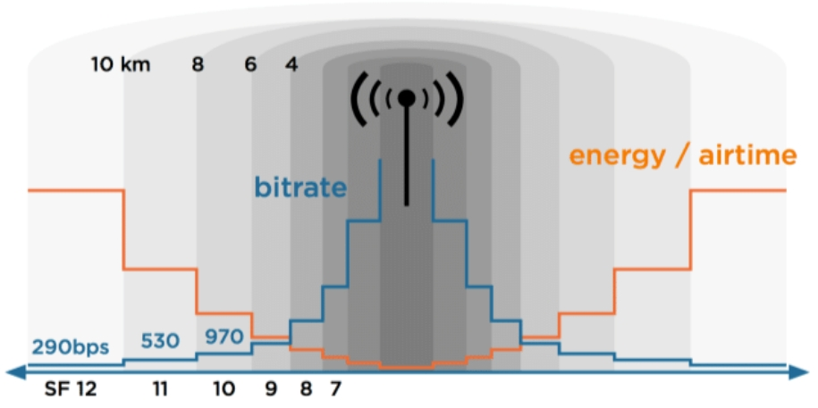

1. IoT/B2C(business-to-consumer)

    the business model of selling products directly to customers and thereby bypassing any third-party retailers, wholesalers, or middlemen. The other one way is Direct-to-consumer (DTC)

2. anti-jamming 抗干扰

3. ZigBee 紫蜂，是一种低速短距离传输的无线网上协议，底层是采用IEEE 802.15.4标准规范的媒体访问层与物理层。低速、低耗电、低成本、支持大量网上节点、支持多种网上拓扑、低复杂度、快速、可靠、安全。

4. IoT/B2B（business-to-business）

5.  2017:
    35% Technical executives

    15% Business executiver

6. IoT value chain

    1. connected device -> 
    2. IoT networl ->
    3. IoT platform -> 
    4. Internet|VPN Connection -> 
    5. Business APP

    - 1:Objects Markets
    - 2&3:Operators
    - 4: Cloud Providers
    - 3-5: Systems Integrators
    - 1-7:Solutions Providers

7. LoRaWAN: est un protocole de communication radio qui définit comment des équipements terminaux communiquent sans fil au travers de passerelles, constituant ainsi un réseau étendu à basse consommation (LPWAN).

8. LoRaWAN Architecture:

    1. Device -> 
    2. G/WS: Gateways ->
    3. VPN ->
    4. Network Server -> 
    5. Internet|VPN -> 
    6. APP Server

9. Device Classes

The LoRaWAN specification defines three device types: Class A, Class B, and Class C. All LoRaWAN devices must implement Class A, whereas Class B and Class C are extensions to the specification of Class A devices. All device classes support bi-directional communication (uplink and downlink). During firmware upgrades over-the-air (FUOTA), a device must be switched to Class B or Class C.

https://www.thethingsnetwork.org/docs/lorawan/classes/

10. LoRaWAN SF: spreading factor

https://www.researchgate.net/figure/LoRa-Spreading-Factor-SF-Bitrates-and-Time-on-Air-LoRa-is-chosen-as-the-wireless_fig7_324043563

11. end-to-end AES-128 encryption

12. Roaming

    Le roaming est un terme anglais signifiant « itinérance de données ». Il vous permet d’utiliser toutes les fonctions de votre forfait lorsque le réseau de votre opérateur n’est pas disponible : passer ou recevoir des appels, utiliser le réseau 4G, échanger des SMS/MMS, etc.

13. 3.5G/DC-HSPA+ -> 42.2 Mbps
    
    4G/LTE -> 100Mbps

    4G/LTE Cat.4 -> 150 Mbps

    (LTE-M)

    4G/LTE Adevanced -> 1,000 Mbps

    5G+ -> 10,000 Mbps

5G+专注于提供极高速的数据传输能力，支持高带宽的应用，如高清视频流、增强现实和虚拟现实等。而LTE-M则专注于支持大规模的低功耗设备网络连接，适用于智能计量、智能城市和其他物联网应用。

14. LTE-M : 针对物联网（IoT）设备设计的一个低功耗宽带接入技术。LTE-M属于窄带物联网（NB-IoT）的一种形式，旨在支持大量低功耗设备的网络连接。与上述提到的高速数据传输技术不同，LTE-M主要关注于提供广泛的覆盖、低成本、长电池寿命和高连接密度。

15. NB-IoT

    MMTC(massive Machine Type of Communication):  海量机器类通信（大规模物联网）,5G典型应用场景之一.

    NR-LITE

    URLLC(Ultra Reliable Low Latency Communication critical IoT)

    eMBB(Enhanced Mobile Broadband): 增强移动宽带，是指在现有移动宽带业务场景的基础上，对于用户体验等性能的进一步提升。

16. 

https://www.blueplanet.com/resources/what-is-network-slicing.html

17. mu-mimo

18. Fixed wireless accrss(FWA)

19. V2X-to-everything
    V2X-to-vehicule
