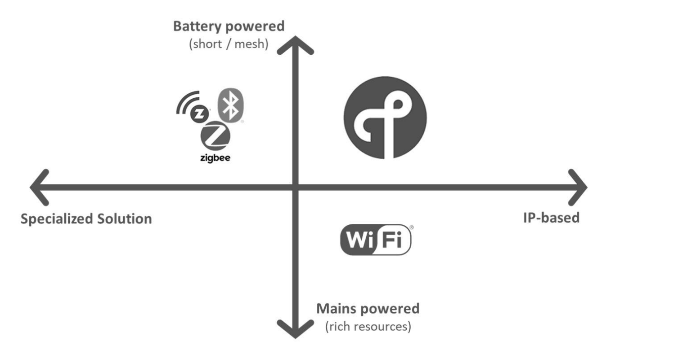

# Internet of Things (IoT) Overview

## 1. Business Models and Communication Protocols

### B2C and B2B Models
- **B2C (Business-to-Consumer):** Selling products directly to consumers, bypassing intermediaries.
- **IoT/B2B (Business-to-Business):** Focus on selling products and services from one business to another.

### Technology Services
- **SaaS (Software as a Service)**
- **IaaS (Infrastructure as a Service)**
- **PaaS (Platform as a Service)**

### IoT Value Chain
- 
- 

  - Connected device -> IoT network -> IoT platform -> Internet|VPN Connection -> Business APP
    - Objects Markets
    - Operators
    - Cloud Providers
    - Systems Integrators
    - Solutions Providers

## 2. Networking and Protocols

### Internet Usage and Content Generation
- **General Internet Use:** Consulting data, mails, and searches. Content generated by humans and machines.

### Indirect Network Topology
- **Non-direct Communication Through a Gateway:** Devices communicate indirectly through gateways.
    - **Path:** Things => Local Network => Gateways Parallel => Internet => Back-End Services
    - **No-IP Use Case:** Gateway interfaces between non-IP and IP worlds for devices using non-IP based applications.

## 3. IoT Devices and Connectivity

### Powered Devices and Specialized Solutions
- **Battery Powered (short/mesh):** Devices typically used for short-distance communications, utilizing mesh network technology.
  - 
- **Mains Powered (rich resources):** Devices connected directly to power sources, capable of supporting complex tasks.
- **Specialized Solution:** Solutions designed for specific applications or functionalities, possibly not adhering to standard IP protocols.
- **IP-based:** Technologies allowing devices to directly connect to the internet and communicate with other IP-based devices.

## 4. RFID Technology
- **RFID (Radio Frequency Identification):** A communication technology used for identifying specific targets and reading/writing data without direct contact.
  - `./IMG/Layer.png`

## 5. Communication Protocols
- **MQTT (Message Queuing Telemetry Transport):** A publish/subscribe messaging protocol designed for low-power devices in unreliable networks.
  - `./IMG/MQTT.png`
- **COAP (Constrained Application Protocol):** A web transfer protocol for constrained nodes and networks in the IoT.
  - `./IMG/COAP.png`
- **LWM2M (Lightweight M2M):** A protocol for device management and service enablement in the IoT ecosystem.

## 6. LoRaWAN Architecture and Classes
- **LoRaWAN Architecture:** Describes how devices communicate wirelessly through gateways in a low-power wide-area network (LPWAN).
  - `./IMG/LORAWAN_ARCH.png`
- **LoRaWAN Class A-B-C:** Different device classes defined by the LoRaWAN specification for various communication needs.
  - `./IMG/LORA_CLASS.png`

## 7. Geolocation and Connectivity in IoT
- **Geolocation in IoT:** Technologies and protocols supporting location services for IoT devices.
  - `./IMG/GEOLOCATION.png`
- **Critical and Massive IoT Bands:** Differentiating between real-time, critical applications and non-real-time, non-critical applications in IoT connectivity.
- **Private Networks and National Coverage:** Business models focusing on wide area network with national coverage versus private network configurations.

## 8. Digital Transformation and Smart Cities
- **IoT in Digital Transformation:** How IoT contributes to the digital transformation of industries and societies.
  - `./IMG/DIGITAL_TRANS.png`
- **Smart City Components:** Integration of sensors, networks, and visualization platforms to create smart city solutions.
