# 1
1. B2C: business-to-consumer

2. - SaaS = Software as Service
    - IaaS = Infrastructure as Service
    - PaaS = Platform as Service

3. Internet => Consult Data / Mails / Search
    - Contant of Internet is generaled by human => Social NTW
    - Human : Graphical Interface / Native language
    - Content of Internet => Things / Machine

4. Indirect Network Topology 
    - Non direct communication through a **Gateway**
    
   Things => Local Network => -Gateways Parallel- => Internet => Back-End Services

    - **No-IP Use case**: The gateway will play the interface between the non-IP and the IP world when non-IP based application is used at the devices.
        1) @Local Address => [Bluetooth,wifi,....]
        2) [IP Gateway]@IP
        3) IP NTW

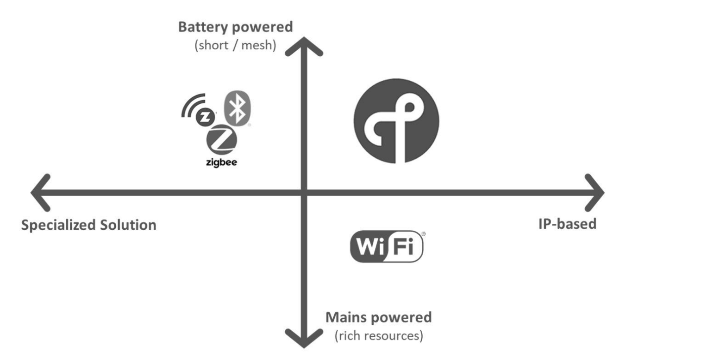
- “Battery powered (short/mesh)”表示使用电池供电的无线设备:
    - 这些设备通常用于短距离通信
    - 网状网络（mesh network）技术 : 扩展覆盖范围。
    - Zigbee，广泛用于家居自动化、IoT和工业控制系统,low-power, 局域无线网络技术, 802.15.4Radio.
    - HREAD: IP Networking, 802.15.4Radio, low-power, self-healing mesh protocol.
    - Bluetooth.

- “Mains powered (rich resources)”代表那些直接连接到电源（不依赖电池供电）的设备:
    - 通常有更多的资源，比如计算能力、内存和能源，可以支持更复杂的任务。
    - Wi-Fi，它是一种用于局域网络的高速无线通信标准，通常用于连接到互联网的设备, IEEE 802.11.

- “Specialized Solution”指的是专门为特定应用或功能设计的解决方案，它们可能不遵循标准的IP协议。

- “IP-based”指的是那些使用互联网协议的技术，使设备能够直接连接到互联网，与其他基于IP的设备通信。

5. 
 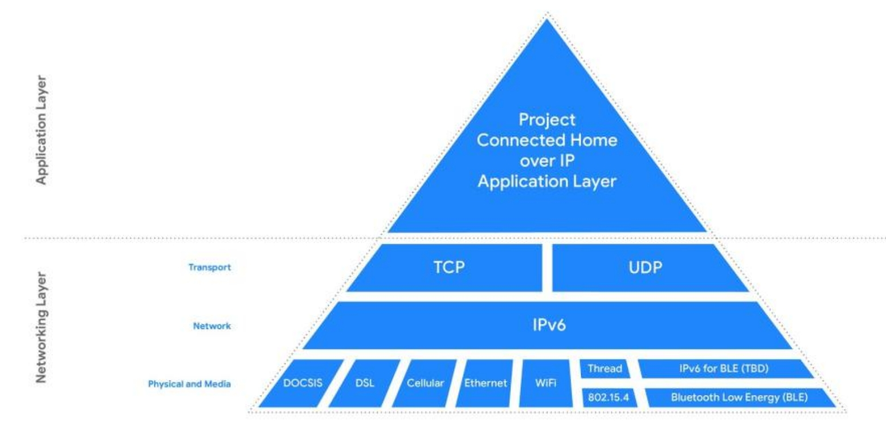
RFID(Radio Frequency Identification)又称无线射频识别，是一种通信技术，可通过无线电讯号识别特定目标并读写相关数据,RFID处于感知层.

    - Bobine : Not Power

    一套完整RFID硬件统由Reader与Transponder两部份组成.
    
    其原理为:
    - 由Reader发射一特定频率的无线电波能量给Transponder
    - 用以驱动Transponder电路将內部的ID Code送出
    - 由Reader接收此ID Code
    
    Transponder的特殊在于免用电池、免接触、免刷卡故不怕脏污，且晶片密码为世界唯一无法复制，安全性高、长寿命

https://zhuanlan.zhihu.com/p/385015812#Rfid%E7%9A%84%E5%9F%BA%E6%9C%AC%E6%A6%82%E5%BF%B5

6. Indirect Network Topology with MQTT (Message Queuing Telemetry Transport)

    subscring -> [-Group/Meet up Group/ Administrators-]administrators do publish -> get notify

https://zhuanlan.zhihu.com/p/421109780

7. (1) Critical IoT Licensed Band
    - Real time
    - Critical application
    - Low data rate
    - High reliability
    - Low latency
    - Mobility & Roaming

    (2) Massive IoT Unlicensed Band
    - Non real time
    - Non critical
    - Very Low data rate
    - Low cost
    - Low power consumption

8. Two Business Models
    1) Wide Area Network with national coverage
    2) Private Network

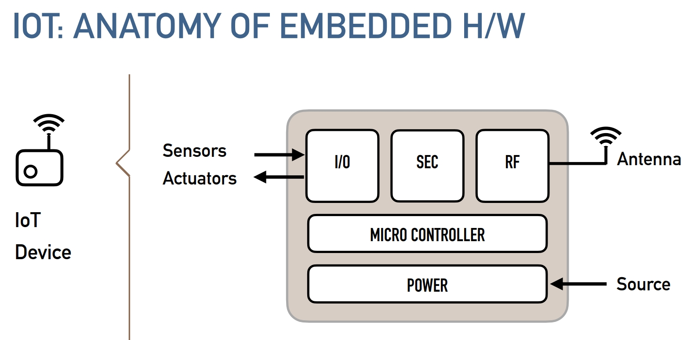
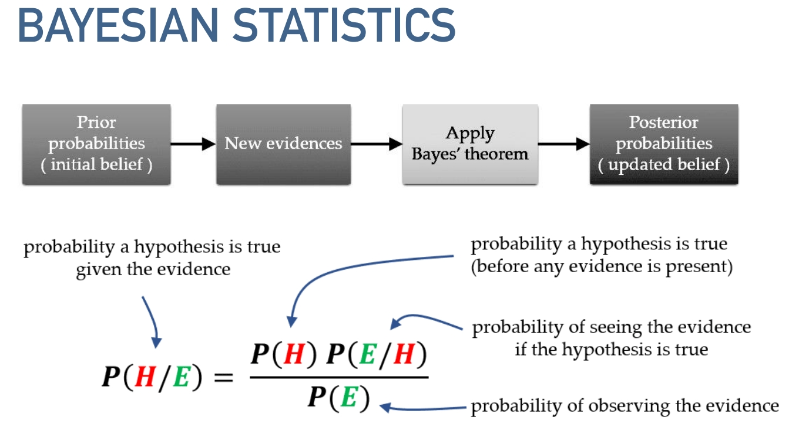

9. IOT IS PART OF DIGITAL TRANSFORMATION:
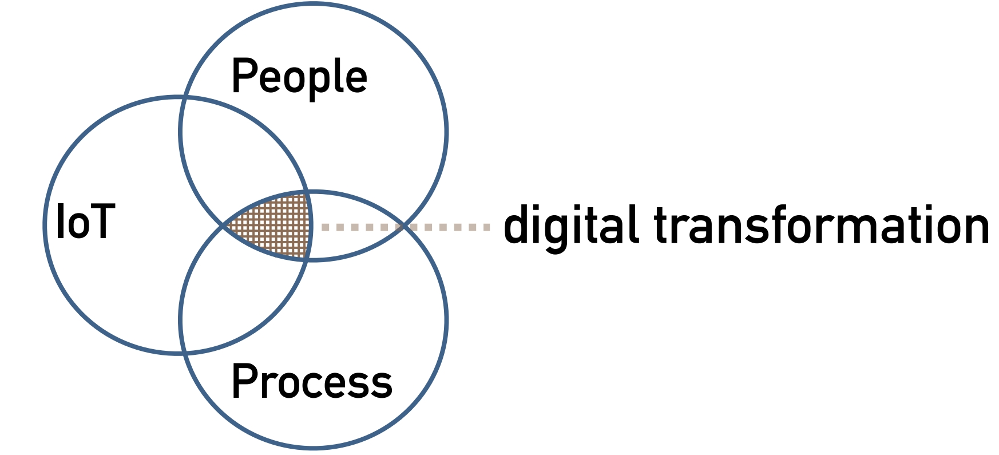

10. IOT VALUE CHAIN
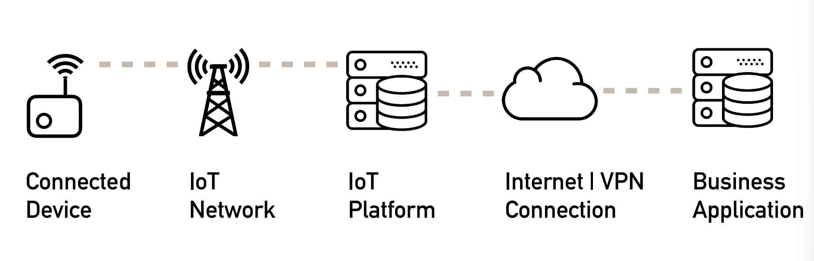
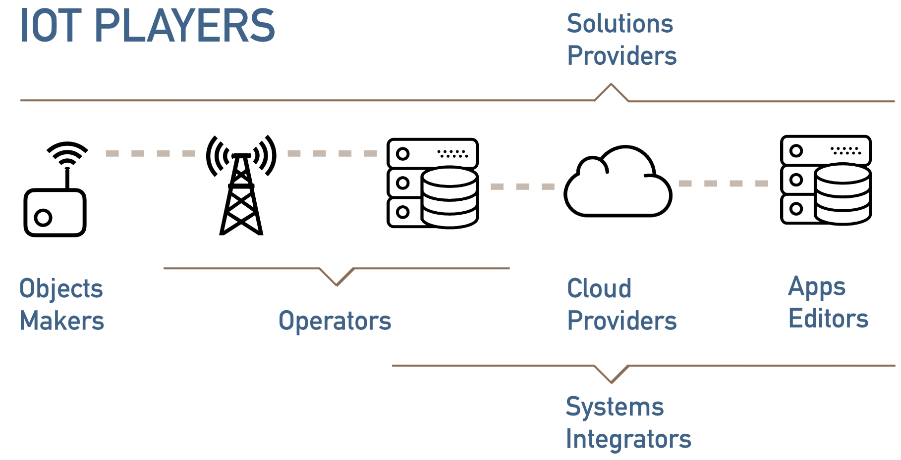

11. Smart City: Capteur + Reseau + Plateform de visualisation

12. LORAWAN ARCHITECTURE:
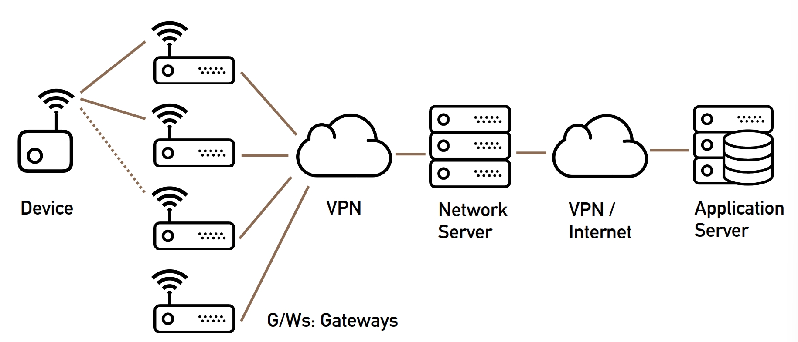

13. 
- LoRaWAN class A-B-C
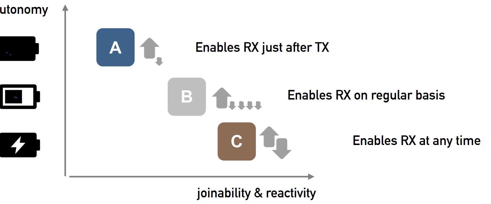
- LORAWAMSF: SPREADING FACTOR 
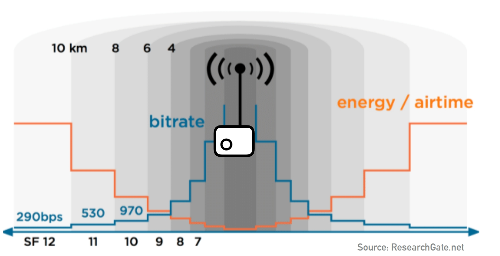

14. Modulation of LoRa
$$2^{SF} = B*T$$

LoRa（Long Range）是一种低功耗广域网（LPWAN）技术，广泛应用于物联网（IoT）项目中，其核心在于提供远距离通信能力同时保持较低的功耗。LoRa的调制技术是其关键特性之一，允许它在噪声环境下保持高效的数据传输。在LoRa调制中，一个重要的概念是扩频因子（Spreading Factor，SF）。

给出的公式$2^{SF} = B*T$直观地展示了扩频因子（SF）、带宽（B）和符号时间（T）之间的关系。这里的意义分解如下：

- **\(2^{SF}\)**: 扩频因子（SF）的值定义了每个符号的编码位数。在LoRa调制中，SF的取值范围通常是从7到12。\(2^{SF}\)表达的是每个LoRa符号可以携带的不同状态的数量，或者说是每个符号的正交性。扩频因子越大，每个符号能携带的信息量就越多，但同时也意味着发送同样量的数据需要更长的时间，因此会减少数据率并增加通信的时间。

- **B**: 表示LoRa信号的带宽，单位是赫兹（Hz）。带宽是信号在频域的宽度，直接影响到数据传输速率和通信距离。在LoRa技术中，常见的带宽设置有125 kHz、250 kHz和500 kHz等。

- **T**: 符号时间，即传输单个LoRa符号所需的时间，单位是秒（s）。符号时间T是SF和带宽B的函数，反映了在给定扩频因子和带宽下，传输一个符号需要多少时间。随着SF的增加，符号时间也会增加，这意味着数据传输速率会降低，但能够提高信号的传输距离和抗干扰能力。

简而言之，这个公式展示了在LoRa通信中，扩频因子SF、带宽B和符号时间T三者之间的关系。通过调整这些参数，可以根据实际应用场景的需求（如距离、数据率和能耗）来优化LoRa通信系统的性能。

15. MTC: machine type communication

16. GEOLOCATION
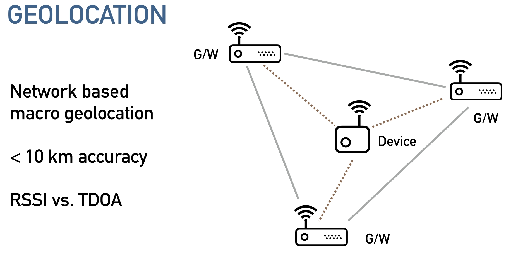

17. 5G = EVOLUTION+REVOLUTION
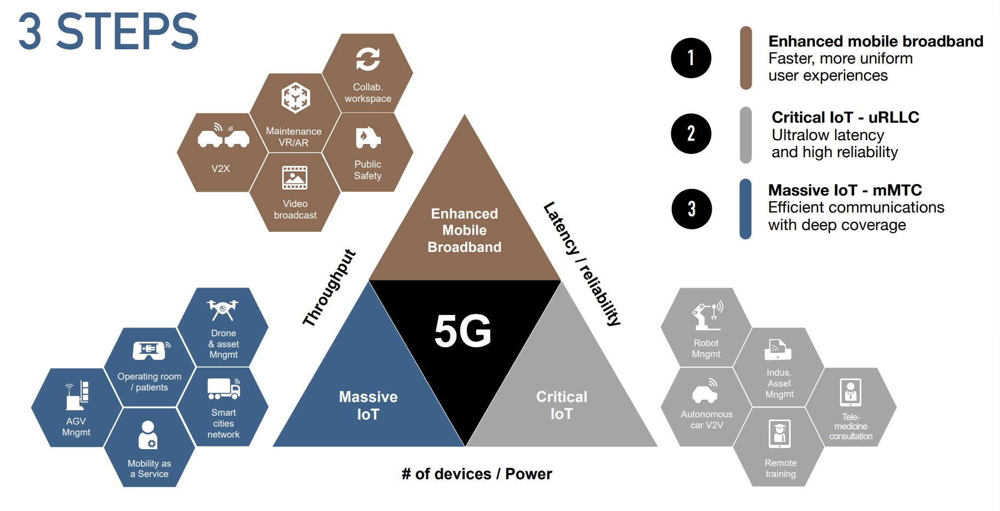

18. TREADE-OFF
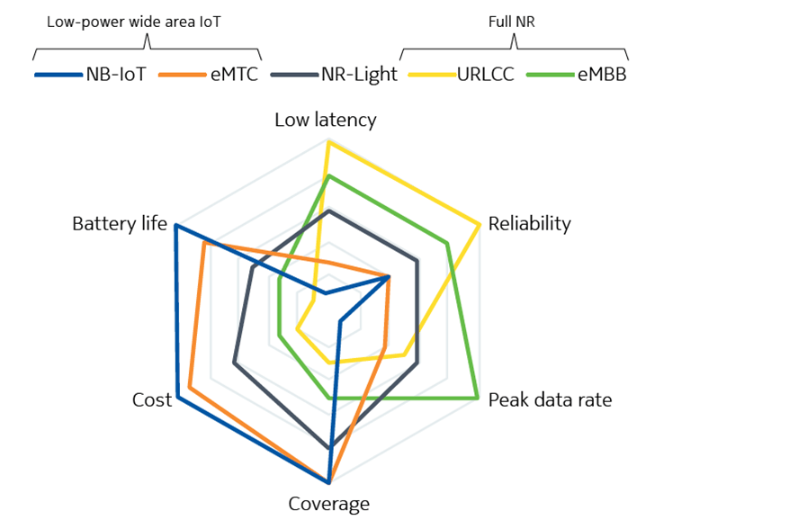

19. 
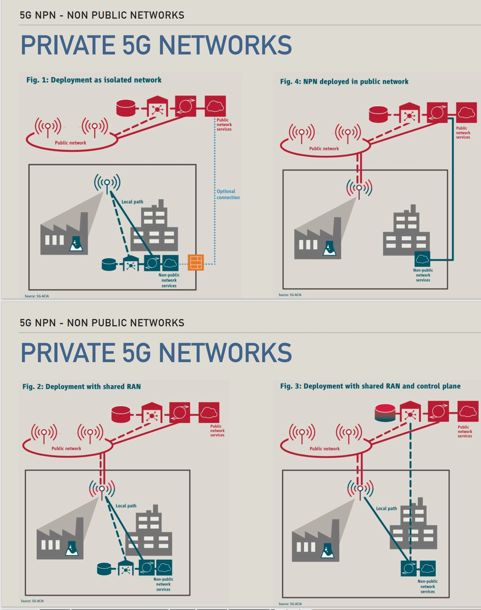

# 2
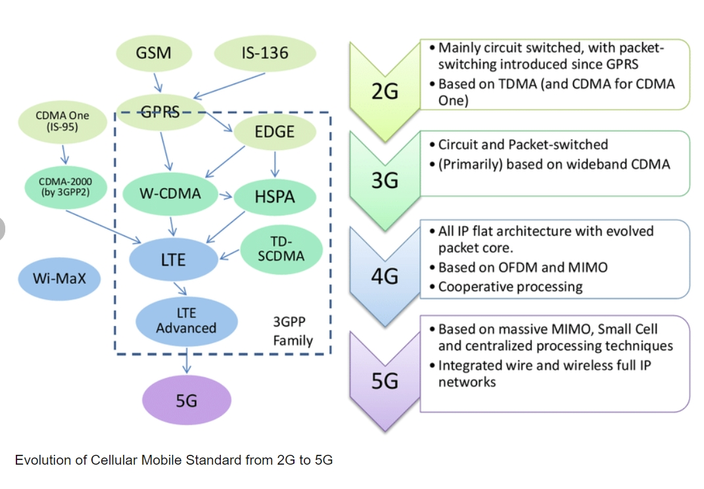

1. MQTT: 消息队列遥测传输（英语：Message Queuing Telemetry Transport，MQTT）是ISO 标准（ISO/IEC PRF 20922）下基于发布（Publish）/订阅（Subscribe）范式的消息协议，可视为“资料传递的桥梁”。它工作在TCP/IP协议族上，是为硬件性能低下的远程设备以及网络状况糟糕的情况下而设计的发布/订阅型消息协议。为此，它需要一个消息中间件（如HTTP），以解决当前繁重的资料传输协议。
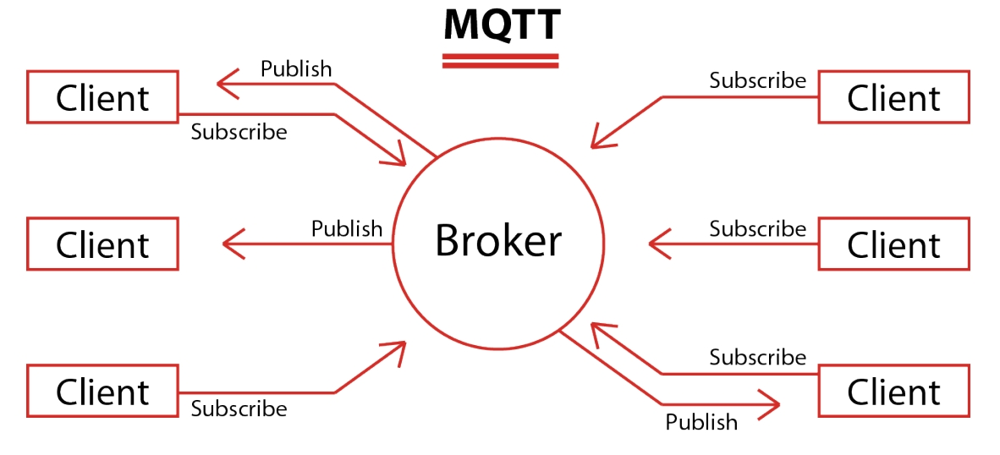

2. COAP: 受限制的应用协议（英文：Constrained Application Protocol，缩写：CoAP）是一种专用的Web传输协议，用于物联网中的受约束节点和受约束的网络。 该协议专为机器对机器（M2M）应用而设计，如智能能源和楼宇自动化。
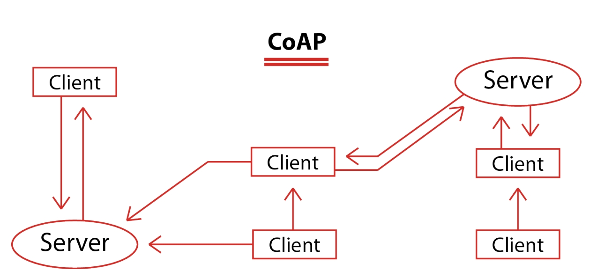

3. LWM2M: OMA Lightweight M2M (LwM2M) is a protocol from the Open Mobile Alliance for machine to machine (M2M) or Internet of things (IoT) device management and service enablement. The LwM2M standard defines the application layer communication protocol between an LwM2M Server and an LwM2M Client which is located in an IoT device. It offers an approach for managing IoT devices and allows devices and systems from different vendors to co-exist in an IoT- ecosystem. LwM2M was originally built on Constrained Application Protocol (CoAP) but later LwM2M versions also support additional transfer protocols.

4. BEEHIVES

5. Software:
```
lo.begin(MQTT,TLS,true);
// 初始化一个网络通信客户端，准备在使用MQTT协议进行消息传递，此通信应使用TLS协议进行加密。
lo.connect();
//执行实际的连接操作，尝试通过前面初始化的参数和配置，连接到MQTT服务器。
```
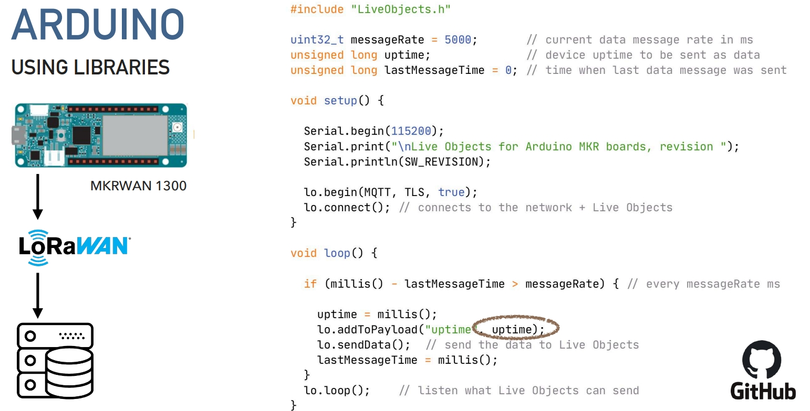

6. AIOT = AI + IOT

7. 
- dBm & dB
$$Power(dBm) = 10*log_{10}\frac{Power(Watt)}{0,001}$$

$$Power Ratio(dB) = 10*log_{10}\frac{P_R}{P_T}$$

- LoRaWan - FREE SPACE LOSS
$$L(fs) (unit is dB) = 32.45 + 20•log(d) + 20•log(f)$$

- LORAWAN - DATA RATES
$$Bit Rate(bit/s) = SF\frac{Bandwidth}{2^{SF}}$$

8. 
- Cellular IOT?
    - without need Complex Local Infrastructure & Short-Range Communication Technologies
    - disconnection

-  LTE?
    - Low power technologies
    - Max throughput(DL/UL) bigger than NB-IOT(LTE CAT-NB1)

- LPWAN landscape

8. LTE-M ESSENTIALS
- LET evolution 

9. - PSM: Power Saving Mode
    - EDRX: ECTENDED DISCONTINUOUS RECEPTION
    - EC: ECTENDED COVERAGE

# 3
 1. IoT/B2C(business-to-consumer)

    the business model of selling products directly to customers and thereby bypassing any third-party retailers, wholesalers, or middlemen. The other one way is Direct-to-consumer (DTC)

2. anti-jamming 抗干扰

3. ZigBee 紫蜂，是一种低速短距离传输的无线网上协议，底层是采用IEEE 802.15.4标准规范的媒体访问层与物理层。低速、低耗电、低成本、支持大量网上节点、支持多种网上拓扑、低复杂度、快速、可靠、安全。

4. IoT/B2B（business-to-business）

5.  2017:
    35% Technical executives
    15% Business executiver

6. IoT value chain

    1. connected device -> 
    2. IoT networl ->
    3. IoT platform -> 
    4. Internet|VPN Connection -> 
    5. Business APP

    - 1:Objects Markets
    - 2&3:Operators
    - 4: Cloud Providers
    - 3-5: Systems Integrators
    - 1-7:Solutions Providers

7. LoRaWAN: est un protocole de communication radio qui définit comment des équipements terminaux communiquent sans fil au travers de passerelles, constituant ainsi un réseau étendu à basse consommation (LPWAN).

8. LoRaWAN Architecture:

    1. Device -> 
    2. G/WS: Gateways ->
    3. VPN ->
    4. Network Server -> 
    5. Internet|VPN -> 
    6. APP Server


9. Device Classes

The LoRaWAN specification defines three device types: Class A, Class B, and Class C. All LoRaWAN devices must implement Class A, whereas Class B and Class C are extensions to the specification of Class A devices. All device classes support bi-directional communication (uplink and downlink). During firmware upgrades over-the-air (FUOTA), a device must be switched to Class B or Class C.

https://www.thethingsnetwork.org/docs/lorawan/classes/

10. LoRaWAN SF: spreading factor
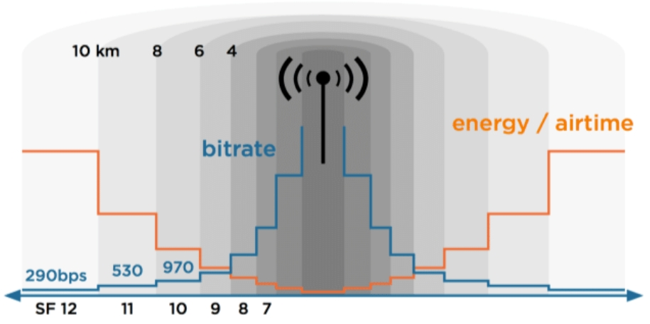

https://www.researchgate.net/figure/LoRa-Spreading-Factor-SF-Bitrates-and-Time-on-Air-LoRa-is-chosen-as-the-wireless_fig7_324043563

11. end-to-end AES-128 encryption

12. Roaming

    Le roaming est un terme anglais signifiant « itinérance de données ». Il vous permet d’utiliser toutes les fonctions de votre forfait lorsque le réseau de votre opérateur n’est pas disponible : passer ou recevoir des appels, utiliser le réseau 4G, échanger des SMS/MMS, etc.

13. 3.5G/DC-HSPA+ -> 42.2 Mbps
    
    4G/LTE -> 100Mbps

    4G/LTE Cat.4 -> 150 Mbps

    (LTE-M)

    4G/LTE Adevanced -> 1,000 Mbps

    5G+ -> 10,000 Mbps

5G+专注于提供极高速的数据传输能力，支持高带宽的应用，如高清视频流、增强现实和虚拟现实等。而LTE-M则专注于支持大规模的低功耗设备网络连接，适用于智能计量、智能城市和其他物联网应用。

14. LTE-M : 针对物联网（IoT）设备设计的一个低功耗宽带接入技术。LTE-M属于窄带物联网（NB-IoT）的一种形式，旨在支持大量低功耗设备的网络连接。与上述提到的高速数据传输技术不同，LTE-M主要关注于提供广泛的覆盖、低成本、长电池寿命和高连接密度。

15. NB-IoT

    MMTC(massive Machine Type of Communication):  海量机器类通信（大规模物联网）,5G典型应用场景之一.

    NR-LITE

    URLLC(Ultra Reliable Low Latency Communication critical IoT)

    eMBB(Enhanced Mobile Broadband): 增强移动宽带，是指在现有移动宽带业务场景的基础上，对于用户体验等性能的进一步提升。

16. 

https://www.blueplanet.com/resources/what-is-network-slicing.html

17. mu-mimo

18. Fixed wireless accrss(FWA)

19. V2X-to-everything
    V2X-to-vehicule
