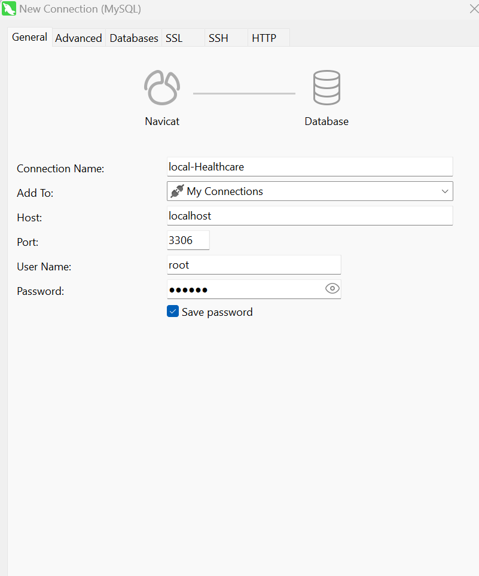

# Database
## MYSQL
1. 下载安装包并安装
2. 在路径下添加my.Ini文件
    ```
    [mysqld]
    port=3306
    lc-messages-dir=C:\\Program Files\\MySQL\\MySQL Server 8.3\\share\\english
    datadir=C:\\Program Files\\MySQL\\MySQL Server 8.3\\data
    max_connections=200
    max_connect_errors=10
    character-set-server=utf8
    default-storage-engine=INNODB
    authentication_policy=mysql_native_password

    [mysql]
    default-character-set=utf8mb4

    [client]
    port=3306
    default-character-set=utf8

    [WinMySQLAdmin]
    Server=C:\\Program Files\\MySQL\\MySQL Server 8.3\\bin\\mysqld.exe
    ```
3. 在PATH中添加bin文件
4. 管理员身份运行cmd
5. 指令调取初始系统信息（调取临时密码）：
    ```
    mysqld --initialize --console
    ```
6. 指令安装Mysql系统：
    ```
    mysqld --install
    ```
7. 指令启动Mysql：
    ```
    net start mysql
    ```
    - 若启动失败需要检查端口是否被占用，若被占用需要进入管理器关闭相关进程
        ```
        netstat -ano | findstr :3306
        ```
8. 登录MySQL服务器：
    ```
    mysql -u root -p
    ```
    - 检查用户表：
        ```
        SELECT user, host, authentication_string FROM mysql.user WHERE user='root';
        ```
9. 修改初始密码:
    ```
    ALTER USER 'root'@'localhost' IDENTIFIED BY 'new_password';
    ```
    - 刷新权限使密码修改立刻生效
        ```
        FLUSH PRIVILEGES;
        ```
    - 退出MySQL
        ```
        EXIT;
        ```

## Navicat
1. 下载并正常安装
2. Add new connection


# JAVA / IntelliJ IDEA
1. 下载
2. PATH中添加JAVA
3. 系统变量中添加JAVA_HOME