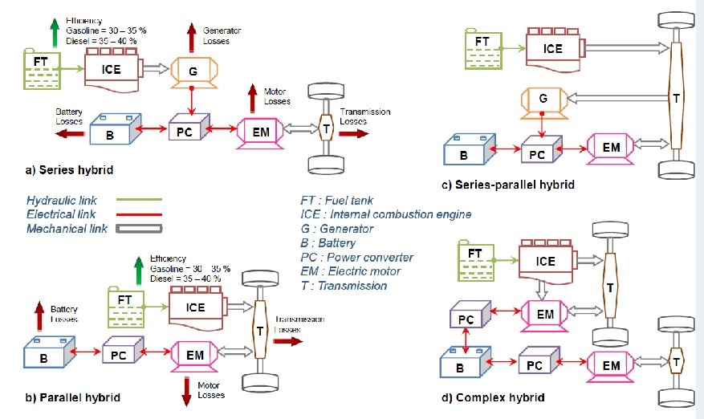

# 1&2 Cours Autonomous-Vhcl
### Autonomous Vehicle
Autonomous vehicles are transforming modern transportation by offering advanced driving capabilities that rely on sophisticated sensors, data exchanges, and artificial intelligence. These vehicles aim to reduce human involvement, which currently accounts for 90% of traffic accidents, leading to significant safety improvements.

### Traffic Jam & Health
Autonomous vehicles can reduce the negative impacts of traffic jams on both mental and physical health. By optimizing traffic flow, autonomous driving systems can alleviate congestion, reduce stress for drivers, and lower the emissions that contribute to respiratory health issues.

### Global Function Approach
The development of autonomous vehicles requires a **global function approach**, integrating various systems like sensors, data analysis, and decision-making processes. This approach ensures that the vehicle operates efficiently under different driving conditions, enhancing overall performance and safety.

### Safety Issues: Best Practices
Safety is a primary concern in the development of autonomous vehicles. To address these concerns, **best practices** must be applied in areas such as software validation, sensor calibration, cybersecurity, and ethical decision-making algorithms, ensuring the highest safety standards are met.

### Human Involvement - 90%
Currently, human error is responsible for 90% of traffic accidents. Autonomous vehicles aim to drastically reduce this number by minimizing human involvement in driving decisions, relying instead on sensor data and AI-driven algorithms.

### 2040 Vision
By the year **2040**, it is expected that autonomous vehicles will become widespread, fundamentally altering the landscape of personal and public transportation. The advancements in sensor technologies, data exchanges, and artificial intelligence will drive this shift toward fully autonomous driving.

### Disruptive Electronic Architecture Due to Data Exchanges (Cloud Included)
The shift toward autonomous vehicles has introduced **disruptive electronic architectures** driven by the massive volume of data exchanges between the vehicle, sensors, cloud systems, and external infrastructure. This new architecture supports real-time decision-making, vehicle-to-cloud (V2C) communication, and large-scale data analytics.

### Comparison of Sensors: Radar, LiDAR, Camera

| **Sensor** | **Advantages** | **Disadvantages** |
|------------|----------------|-------------------|
| **Radar**  | - Lower cost   - Works well in various weather conditions   - Requires moderate computation   - Good range | - Limited resolution and detail |
| **LiDAR**  | - More sensitive to weather than radar   - Provides high-resolution data   - Longer range for object detection | - High cost   - Weather sensitivity is better than radar, but worse than cameras |
| **Camera** | - Low cost   - Long range for object detection | - High computation needs   - Highly sensitive to weather conditions (e.g., rain, fog, and low light) |

### Areas for Improvement: Sensor Fusion
To further enhance the performance and reliability of autonomous vehicles, **sensor fusion** technology must be improved. This involves combining data from multiple sensors (radar, LiDAR, and cameras) to create a comprehensive understanding of the vehicle's surroundings. Effective sensor fusion allows for better decision-making, compensating for the weaknesses of individual sensors.

## V2V(vehicle to vehicle)车与车通信
V2V technology allows vehicles to communicate directly with each other, sharing critical driving information. This exchange of information helps prevent accidents, improves road safety, and optimizes traffic flow. V2V typically uses short-range wireless communication (DSRC) or 5G networks. Key applications include:

- **Collision Avoidance**: Vehicles share data like speed, position, and direction in real time. If the system detects a potential collision, it alerts the driver or autonomously takes action to avoid it.
- **Emergency Braking Alerts**: When a vehicle in front suddenly brakes, it can send an alert to vehicles behind it, allowing them to slow down or change direction in time, preventing chain-reaction crashes.
- **Blind Spot Warning**: If another vehicle is in the driver’s blind spot, the system can alert the driver, enhancing safety.
- **Platooning车辆编队行驶**: V2V can enable coordinated driving among multiple vehicles, allowing them to share acceleration, deceleration, and steering information. This can form tight vehicle groups, improving highway traffic efficiency.

## V2I(vehicle to Infrastructure)车与基础设施通信
V2I facilitates communication between vehicles and road infrastructure (e.g., traffic lights, road sensors, toll stations). This helps optimize traffic management, reduce congestion, and enhance driving comfort. Common applications include:

- **Traffic Light Information Sharing**: Vehicles can communicate with traffic signals to receive real-time data on the status of the lights (e.g., how long the light will remain green). This allows vehicles to adjust speed to avoid sudden stops or abrupt braking.
- **Real-Time Traffic Information**: Sensors on the road detect traffic flow, speed, and conditions, sharing this data with vehicles. Drivers can use this information to choose optimal routes, avoiding congestion and reducing travel time.
- **Road Maintenance and Obstacle Alerts**: V2I systems can notify vehicles about road repairs or unexpected obstacles, helping drivers adjust their routes.
- **Smart Parking Guidance**: With V2I, vehicles can communicate with parking infrastructure, quickly locating available spaces and improving parking efficiency.

## V2X (Vehicle-to-Everything)
1. IEEE 802.11p

2. IEEE 802.11bd

3. Cellular V2X(C-V2X)-defined by 3GPP
    - release-12:D2D
    - Rel-13:eD2D
    - Rel-14:V2V,V2X basic services
    - Rel-15:C-V2X
    - Rel-16:

## Connected vehicle
Data exchange technologies:
- cellular : 3G to 5G
- Wi-Fi: 802.11p
- RFID:keyless...
- Radio broadcast(digital)

## Wi-Fi - Basics
Wireless Fidelity, is based on the IEEE 802.11 family of standards.
2bands: 2.4GHz & 5GHz

## WIFI-RSSI&Access
RSSI(Received Signal Strength Indicator)

Access Methods
- DCF CSMA/CA(mandatory)
- DCF with RTS/CTS
- PCF(optional): Access point polls terminals according to a list

# 3 Cours_Components_FuelCell_Battery
## Intro
1. 能量来源
    
    
    1. 能源来源：
        - 化石燃料（黄色）和可再生能源（绿色），如生物质和可再生电力。
        - 来自化石燃料的箭头指向“燃料”作为能源载体，而可再生电力则可以直接用于发电，或用于生成氢气。
    2. 能源载体：
        - 燃料（来自化石燃料和生物质）用于传统的内燃机汽车（ICE）和混合动力汽车（HEV）。
        - 电力（由可再生能源产生）用于电动汽车（EV），如电池电动汽车（BEV）和部分插电式混合动力汽车（PHEV）。
        - 氢气作为另一种能源载体，用于氢燃料电池电动汽车（FCEV）。
    3. 汽车移动应用： 该图根据电气化和效率水平对车辆类型进行分类：
        - ICE（内燃机）车辆使用汽油、柴油和替代燃料。这些是效率最低、没有电气化的车辆。
        - HEV（混合动力汽车）提供轻度或完全电气化，但电动驾驶里程接近为零，主要依赖化石燃料，辅以一些电力支持。
        - PHEV（插电式混合动力汽车）结合燃料和电力，能够进行短距离电动驾驶，比HEV更高效。
        - EV w/ ICE R.E.（带有内燃机增程器的电动汽车）：完全具备电动汽车的能力，并配备内燃机作为增程器，提升了效率和续航里程。
        - EV w/ FC R.E.（带有燃料电池增程器的电动汽车）：使用燃料电池，具有零排放和经济的电动续航里程。
        - BEV（电池电动汽车）：完全依赖电力驱动，零排放，使用可再生电力，提供足够的续航里程。
        - FCEV（燃料电池电动汽车）：使用氢气发电，零排放，提供足够的续航里程。
    4. 效率和电气化： 箭头表明从内燃机汽车（ICE）到完全电动汽车（如BEV和FCEV）的过渡趋势，意味着更高的效率和电气化。在图的右侧，由可再生电力和氢气驱动的车辆提供全面的电气化和零排放，推动可持续性发展。
### Hybrid vehicle / electric
1. 纯电动汽车（Battery Electric Vehicle，简称BEV）没有传统的内燃机引擎。它们完全依靠电动机来驱动，电力来自于车载的电池组。相较于混合动力或插电式混合动力汽车，纯电动汽车没有任何形式的内燃机作为辅助动力源，因此也不需要燃油。
    
    纯电动汽车的主要组成部分包括：
    - 电动机：取代了传统汽车的内燃机，负责驱动车辆。
    - 电池组：储存电能，用于为电动机提供动力。
    - 充电系统：通过外部电源为电池充电。

    由于没有内燃机，纯电动汽车具备零排放的特点，在行驶过程中不会产生尾气排放，同时其机械结构相对简单，维护成本也较低。

2. 电动汽车或混合动力汽车()-关键组成部分
    

    1. HV电池（高压电池）：
        
        高压电池是储存能量的装置，可以储存动能或势能，并以电的形式保存下来。它负责存储通过刹车或其他方式回收的能量，随后为车辆提供动力。
    2. 电动机（Electric motor）：
    
        电动机将电能转换为机械能，用于车辆的牵引阶段，也就是驱动车辆前进。同时，它在制动时通过再生制动过程将机械能转换为电能，重新储存在电池中。这种双向转换提高了能效并减少了能量浪费。
    3. 逆变器（Converter）：

        逆变器是动力输出的计算器，它从多个传感器（如加速踏板、刹车等）接收参数，用来控制电动机的运行。它能够调节电动机的工作状态，并将电池的直流电转换为电动机使用的交流电。
    4. 12V电池：

        混合动力车辆的系统需要由12伏电池提供电力。这种电池在车辆启动时为低压系统和附件（如灯光、音响、控制系统等）提供电能。
    5. DC/DC转换器：

        直流/直流转换器（DC/DC Converter）用于将高压电池的电能（HT电池，高压电池）转换为12V电池所需的电能。它通过这种方式为12V电池充电，确保低压系统能够正常工作。
    6. 充电器：

        充电器用于适配电力分配网络提供的电能（220-380伏交流电），为高压电池（HT电池）充电。这一组件专门用于插电式混合动力汽车（Plug-in HEV），因为这些车辆需要从外部电源为其高压电池充电。

### Modelisation of a vehicle

### 主要变量和参数：
- **v**：车辆速度（单位：米/秒，m/s）
- **a**：车辆加速度（单位：米/秒²，m/s²）
- **ρ**：空气密度（通常取值约为1.2 kg/m³）
- **s**：车辆的正面面积（单位：平方米，m²）
- **Cₓ**：空气阻力系数（无量纲）
- **mᵥ**：车辆及载荷的总质量（单位：千克，kg）
- **g**：重力加速度（约为9.81 m/s²）
- **μ**：滚动摩擦系数（通常约为0.01）
- **α**：坡度角度（单位：弧度，rad）

#### 力的组成部分：

1. **空气阻力（Aerodynamic force, F_aerodynamic）**：
   - 表达式： 
     $$
     F_{\text{aerodynamic}} = 0.5 \times \rho \times C_x \times s \times V^2
     $$
   - 这一部分的力与车辆的速度平方成正比。随着速度增加，空气阻力也迅速增加。

2. **滚动阻力（Rolling resistance, F_rolling）**：
   - 表达式：
     $$
     F_{\text{rolling}} = m_{\text{v}} \times g \times \mu
     $$
   - 滚动阻力与车辆重量及地面的摩擦系数相关。这个力通常与车辆质量和地面类型有关。

3. **加速度力（Acceleration force, F_acceleration）**：
   - 表达式：
     $$
     F_{\text{acceleration}} = m_{\text{v}} \times a
     $$
   - 这是车辆在加速时所需要克服的力，直接与车辆质量和加速度成正比。

4. **爬坡阻力（Climbing force, F_climbing）**：
   - 表达式：
     $$
     F_{\text{climbing}} = m_{\text{v}} \times g \times \sin{\alpha}
     $$
   - 这个力反映了车辆在坡道上行驶时需要克服的重力分量。坡度越大，爬坡阻力越大。

#### 总的力（F）：
- 公式：
  $$
  F = F_{\text{aerodynamic}} + F_{\text{rolling}} + F_{\text{acceleration}} + F_{\text{climbing}}
  $$
- 该公式将车辆在运动过程中需要克服的所有主要力加在一起，计算出总的作用力。

#### 功率（P）：
- 根据总力 \( F \) 可以计算出车辆所需的功率 \( P \)，表达式为：
  $$
  P = F \times v
  $$
- 功率单位是瓦特（W），它是由力和车辆的速度共同决定的。

### Architectures

#### (a) 串联混合动力 (Series Hybrid)
在串联混合动力系统中，内燃机（ICE）不直接驱动车轮。它的工作流程如下：
1. **燃料箱（FT）**：为内燃机（ICE）提供燃料。
2. **内燃机（ICE）**：驱动发电机（G），发电机将机械能转化为电能。
3. **发电机（G）**：产生的电能通过功率转换器（PC），为电动机（EM）供电或存储在电池（B）中。
4. **电动机（EM）**：直接驱动车轮，提供动力。
5. **电池（B）**：存储回收的能量，并在需要时为电动机提供电能。

串联混合动力系统的特点是内燃机不直接与传动系统（T）相连，内燃机的主要任务是发电。该系统能量传递路径较长，存在发电和电动机的效率损失。

#### (b) 并联混合动力 (Parallel Hybrid)
在并联混合动力系统中，内燃机和电动机可以同时驱动车轮，路径较为直接：
1. **燃料箱（FT）**：为内燃机提供燃料。
2. **内燃机（ICE）**：可以通过变速箱（T）直接驱动车轮。
3. **电动机（EM）**：也可以通过变速箱（T）驱动车轮，与内燃机并联工作。
4. **电池（B）**：电池通过功率转换器（PC）为电动机供电。
   
并联混合动力的优势在于，电动机和内燃机可以独立或协同工作，根据驾驶情况优化效率。该架构简单直接，损耗较少。

#### (c) 串并联混合动力 (Series-Parallel Hybrid)
串并联混合动力系统结合了串联和并联混合动力的优点：
1. **燃料箱（FT）**：为内燃机提供燃料。
2. **内燃机（ICE）**：既可以通过发电机（G）为电池充电，也可以直接通过变速箱（T）驱动车轮。
3. **发电机（G）**：将内燃机产生的机械能转化为电能，通过功率转换器（PC）为电池充电或直接驱动电动机（EM）。
4. **电动机（EM）**：可以单独或与内燃机协同驱动车轮。
5. **电池（B）**：存储电能，为电动机提供动力。

串并联混合动力系统灵活性强，能根据不同的行驶需求在串联或并联模式之间切换。

#### (d) 复杂混合动力 (Complex Hybrid)
复杂混合动力系统是将串并联系统进一步复杂化的版本，能够实现更多样的动力组合和能量管理方式：
1. **燃料箱（FT）**：为内燃机提供燃料。
2. **内燃机（ICE）**：可以直接驱动车轮或通过发电机（G）发电。
3. **发电机（G）**：将机械能转换为电能，为电池充电或直接驱动电动机。
4. **电动机（EM）**：可以直接驱动车轮，或在需要时与内燃机协同工作。
5. **电池（B）**：为电动机提供动力。

这种复杂系统可以在不同驾驶条件下优化动力输出和能量使用效率，但由于系统复杂，控制难度较大。

---

#### 关键组成部分：
- **FT**：燃料箱，存储燃料。
- **ICE**：内燃机，燃烧化石燃料产生动力。
- **G**：发电机，内燃机驱动其产生电能。
- **B**：电池，存储电能。
- **PC**：功率转换器，调节电能流向。
- **EM**：电动机，将电能转化为机械能驱动车轮。
- **T**：变速箱，将动力传递至车轮。

#### 总结：
这四种混合动力系统各有优缺点：
- **串联混合动力**：内燃机不直接驱动车辆，更适合低速城市行驶。
- **并联混合动力**：电动机和内燃机同时工作，适应多种驾驶情况。
- **串并联混合动力**：结合两种模式的优点，提供更高的效率。
- **复杂混合动力**：最灵活但最复杂，适用于高级节能需求的场景。

## Batteries
1. The electric vehicle is characterized by the fact that in addition to the propulsion power, it should store the required energy to ensure acceptable performance and autonomy. Storage requirements are not the same. High
storage capacity is needed: charge and discharge cycles are slow. This type of vehicle uses battery of energy.

    电动汽车需要储存大量电能以确保良好的性能和续航能力。由于充放电周期较慢，因此电动汽车通常使用大容量电池储存能量。

2. For a hybrid vehicle, a small amount of storage is sufficient. Simply store the kinetic and potential energies until their use in the next acceleration.
This type of vehicle uses battery of power.

    混合动力汽车仅需要储存少量电能，主要用于回收动能和势能，并在加速时使用。混合动力汽车使用的是功率电池。

3. 电能储存的两个关键参数是：

    - **Usable power**（可用功率）：$P = I · U$ 
    - **Stored energy**（储存的能量）：以kilowatt-hour (kWh)表示.

### Batteries used in automotive

1. **纵轴（W/kg）** 表示功率密度，即电池在单位质量下能提供的最大功率。功率密度越高，电池能够在短时间内释放的能量就越多。
2. **横轴（Wh/kg）** 表示能量密度，即电池在单位质量下能储存的能量。能量密度越高，电池能够储存的总能量就越多，从而提供更长的续航里程。

#### 不同电池类型的性能：
1. 超级电容（Supercapacitor）：
    - 位置：图的左侧，功率密度很高，但能量密度非常低。
    - 特点：超级电容可以快速充放电，适合需要瞬时大功率的场景，但不能存储太多能量。
2. 铅酸电池（Batterie plomb, Pb）：
    - 位置：图中靠左，功率和能量密度较低。
    - 特点：这是早期常用的电池，具有较低的能量密度和功率密度，重量大，适合成本敏感的应用，但在现代电动汽车中使用较少。
3. 镉镍电池（Batterie Cadmium Nickel, Cd-Ni）：
    - 位置：与铅酸电池相似，但稍微提高了功率密度。
    - 特点：这种电池具有更好的充放电性能，但因为环保问题和能量密度不高，使用较少。
4. 镍氢电池（Batterie Nickel Métal hydrure, Ni-Mh）：
    - 位置：能量密度和功率密度都高于铅酸电池和镉镍电池，位于中间位置。
    - 特点：这种电池曾经广泛应用于混合动力汽车中，因为它比铅酸电池有更好的能量密度和循环寿命。
5. 锂离子电池（Lithium-Ion, Li-Ion）：
    - 位置：在图的右上角，具有最高的能量密度和较高的功率密度。
    - 特点：锂离子电池是目前电动汽车最常用的电池，具有较高的能量密度，能够提供更长的续航能力，同时也具备较好的功率密度，适合长时间供电和快速加速。
#### 总结
1. 超级电容：适合需要快速充放电的应用，但不适合存储大量能量。
2. 铅酸电池和镉镍电池：功率和能量密度较低，适合较为简单的储能需求。
3. 镍氢电池：平衡了能量和功率密度，适合混合动力车辆。
4. 锂离子电池：提供了最佳的能量和功率密度组合，广泛应用于现代电动汽车，因其能量存储能力强和续航能力好而受到青睐。

## Fuel cells

# 15102024
## Wifi 2.4GHz

## Wifi 5GHz
- IEEE 802.11N
- IEEE 802.11ac

## IEEE 802.11p

## Friis Formula
Friis传输方程（Friis Transmission Formula）用于估算自由空间中，发射天线与接收天线之间的电波功率传输。该公式主要用于天线理论、无线通信和射频工程，描述了信号从发射到接收时功率的损失。该公式适用于远场条件下的理想无线信号传输。

### Friis传输方程的基本形式：

$$
P_r = P_t \times G_t \times G_r \times \left( \frac{\lambda}{4 \pi d} \right)^2
$$

其中：
- $P_r$ 是接收天线的接收功率（单位：瓦，W）。
- $P_t$ 是发射天线的发射功率（单位：瓦，W）。
- $G_t$ 是发射天线的增益（无量纲）。
- $G_r$ 是接收天线的增益（无量纲）。
- $\lambda$ 是信号波长（单位：米，m），可以通过 $\lambda = \frac{c}{f}$ 计算，其中 $c$ 是光速，约为 $3 \times 10^8 $ 米每秒，$ f $ 是信号频率（单位：赫兹，Hz）。
- $d $ 是天线之间的距离（单位：米，m）。

#### 该公式适用于自由空间，即无反射、无障碍的传播环境。它的基本假设是：

1. 信号在远场条件下传播（距离远大于波长）。
2. 没有干扰、反射或阻挡。
3. 天线增益已知并是定向的。
4. 电磁波功率以球面波的形式传播，随着距离平方成反比减弱。

#### 公式解释：
- **波长**：频率越高，波长越短，功率衰减得越快，因此更高频率的信号在相同的距离上会损失更多的功率。
- **距离衰减**：接收功率与发射和接收天线的距离平方成反比。也就是说，距离每增加一倍，接收功率会减少到原来的四分之一。

## E.M Waves propagation

# 12/11/2024 Vehicle Architecting for <ACEs>
1. ACES
    - Autonomous Vehicles
    - Connected Vehicles
    - Electrification 
    - Shared mobility

