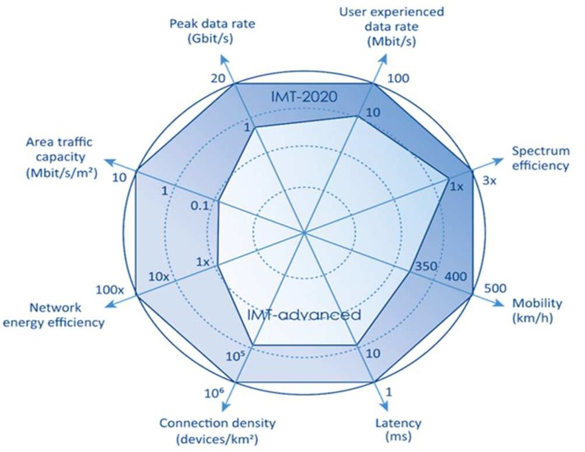

# 18/09/2024
## 5G and Telcos Softwarization
1. Technology:
    - 1G: Analog
    - 2G: Digital(GSM,CDMA)
    - 3G: Digital(Universal Mobile Telecommunications System(UMTS)-欧洲及其他地区；CDMA2000-北美和亚洲)
    - 4G: LTE(Long-Term Evolution), LTE-A
    - 5G: NR(New Radio)

2. 下载时间（s）= 文件大小（bit）/ 网络速度（bps）
    $$
    1 \text{ GB} = 1024 \text{ MB} = 1024^2 \text{ KB} = 1024^3 \text{ Byte} = 1024^3 \times 8 \text{ bit}
    $$

3. Standardization Bodies:
    - Telecom standardization bodies are organizations that develop and promote technical standards for telecommunications.
    - These standards ensure interoperability, safety, and efficiency in communication systems.

        - **TM Forum (TeleManagement Forum)**: 全球电信行业的非营利性组织，致力于帮助通信服务提供商和数字服务提供商转型。它提供一套标准和框架，如 Frameworx，用于业务流程管理、系统集成和数字化转型。
        - **GSMA (Global System for Mobile Communications Association)**: 全球移动通信系统协会，是一个代表全球移动通信运营商和公司利益的行业组织。GSMA 负责制定 GSM、LTE 和 5G 等移动通信标准，并组织世界移动通信大会（MWC）等行业活动，促进移动通信产业的发展。
        - **3GPP (3rd Generation Partnership Project)**: 第三代合作伙伴计划，是一个由多个标准组织组成的合作项目，负责制定全球移动通信标准，包括3G（UMTS）、4G（LTE）和5G（NR）的技术规范。
        - **NGMN (Next Generation Mobile Networks Alliance)**: 下一代移动网络联盟，旨在确保移动通信网络的下一代技术满足用户需求。NGMN 联盟为运营商、制造商和研究机构提供一个平台，推动5G和未来移动通信网络的发展。
        - **CNCF (Cloud Native Computing Foundation)**: 云原生计算基金会，是一个致力于推广云原生技术的非营利性组织。CNCF 为电信行业提供了云原生架构、容器化和微服务等关键技术，以提高网络基础设施的灵活性和可扩展性。CNCF 支持并维护了一些关键项目，如 Kubernetes、Prometheus 和 Envoy，用于现代化电信网络的管理和运维。

4.  
- Enhanced Mobile Broadband

- Enhanced Mobile eMBB

主要用于高带宽和高速数据传输的场景，如高清视频、VR/AR、流媒体和高速移动通信。

- Ultra Reliable Low Latency（URLLC）

用于需要超低延迟和高可靠性的场景，如触觉互联网、自动驾驶和远程医疗。

- Massive Machine Type Communications (mMTC)

用于大量物联网设备的低功耗、低速率连接，如传感器网络和智能城市。

.png)

- NGMN use case groups

    (1) Broadband access in dense areas（密集区域的宽带接入）
    - 应用场景：Pervasive Video 普遍视频。在城市中心、体育场馆等人流密集区域提供高质量的视频服务，满足高数据速率和带宽需求，如4K/8K视频直播、VR/AR体验等。
    - 关联5G特性：eMBB
    
    （2）Broadband access everywhere（随处可用的宽带接入）
    - 应用场景：50+ Mbps Everywhere（50Mbps以上的速率）。无论在城市、乡村还是高速公路上，5G都能提供稳定的宽带接入，确保用户在任何地方都能享受高速互联网连接。
    - 关联5G特性：eMBB

    （3）Higher user mobility（更高的用户移动性）
    - 应用场景：High Speed Train（高速列车）。在高速移动的环境中，如高铁，提供可靠的高速网络连接，确保用户在高速移动中仍然能够进行视频通话、流媒体等高带宽需求的活动。
    - 关联5G特性：eMBB

    （4）Massive Internet of Things（海量物联网）
    - 应用场景：Sensor Networks（传感器网络）。支持大量物联网设备的连接，如传感器网络，用于智能城市、环境监测、智能农业等场景。需要支持低功耗、低速率的大规模连接。
    - 关联5G特性：mMTC

    （5）Extreme real-time communications（极端实时通信）
    - 应用场景：Tactile Internet（触觉互联网）。需要超低延迟和高可靠性的通信场景，如触觉互联网、远程控制和自动驾驶等，要求毫秒级的延迟来保证实时响应。
    - 关联5G特性：URLLC

    （6）Lifeline communications（生命线通信）
    - 应用场景：Natural Disaster（自然灾害）。在自然灾害或紧急情况下提供可靠的通信服务，确保救援人员和灾区之间的通信畅通，支持紧急呼叫和定位等服务。
    - 关联5G特性：URLLC

    （7）Ultra-reliable communications（超可靠通信）
    - 应用场景：E-Health Services（电子健康服务）。需要极高可靠性和低延迟的通信服务，如远程医疗、手术机器人等场景，确保数据传输的准确性和及时性。
    - 关联5G特性：URLLC

    （8）Broadcast-like services（类似广播的服务）
    - 应用场景：Broadcast Services（广播服务）。提供类似广播的服务，如大型活动的实时流媒体广播，需要高带宽和广覆盖。
    - 关联5G特性：eMBB

5. IMT-2020(5G) vs. IMT-ADVANCED(4G)

- **Peak Data Rate:** maximum rate per user underideal conditions. 10 Gbps for mobiles, 20 Gbpsunder certain conditions.
- **User experienced Data Rate:** 95% Rate across thecoverage area per user. 100 Mbps inurban/suburban areas.1 Gbps hotspot.
- **Spectrum Efficiency:** Throughput per Hz per cell
- **Mobility:** Max speed at which seamless handoverand QoS is quaranteed
- **Latency:** Radio contribution to latency betweensend and receive
- **Connection Density:** Devices per km2
- **Network Energy Efficiency:** Network bits per Joule.User bits per Joule
- **Area Traffic Capacity:** Throughput per m2

### Core Netword Evolution from 4G to 5G ###
1. UE(User Equipement): Smartphone，Tablet，Laptop，Wearable Devices，IoT Devices，In-Vehicle Systems，Fixed Wireless Access Devices，VR/AR Devices，USB Dongle，Mobile Hotspot
2. - User PLANE: 指网络中承载用户数据流的部分。它负责传输实际的用户数据，如网页浏览、视频流、语音通话等。这是网络中用于实际传输用户信息的路径。
        - 数据传输：在用户和互联网或其他通信方之间传递数据。
        - QoS（Quality of Service）：在传输过程中提供不同服务质量的保障，确保关键数据流的优先级。
        - 加密：为用户数据提供安全性，防止未经授权的访问。
    - Control PLANE: 指网络中负责控制信令和管理的部分。它负责控制和管理网络资源，包括用户的接入、移动性管理、建立和维护连接等。Control Plane 主要处理信令信息，决定如何传输用户数据。
        - 信令管理：管理信号传输，以便建立、维护和释放网络连接。
        - 会话管理：控制数据会话的建立、修改和终止，包括分配和管理 IP 地址。
        - 移动性管理：确保用户在移动过程中保持连接，提供漫游和切换等功能。
        - 资源分配：管理网络资源的分配和优化，以满足不同用户和服务的需求。

3. 4G vs 5G Functions - Gateways: 
    - SGW(Serving Gateway)
        - for 4G, handle mobility and session management
    
    - PGW
    
    - UPF(User Plane Function)
        - for 5G, replace SGW&PGW in 5G

4. 5G system Service Based Architecture(SBA)

https://medium.com/5g-nr/5g-service-based-architecture-sba-47900b0ded0a

    （1）AMF
    （2）UPF
    （3）PCF
    （4）AUSF
    （5）UDM
    （6）NRF
    （7）NEF
    （8）AF

### 5G NSA & 5G SA(Stand-Alone)

Only 5G core network (dependes form 4G)

